# 翼型的分类：

出处： 
<http://iw168.cn/news/jixsj/6988.html>
<http://blog.sina.com.cn/s/blog_706bbe1a0101idal.html>

鸟能在天空翱翔，就仗着它比其它动物多了一副翅膀。
仔细观察鸟的翅膀，你会发现它的横截面很奇特：上面是个弧线，下面接近平面。假定鸟在滑翔状态，它为什么不掉下来呢？我们知道弧线的长度比直线长，那么气流经过翅膀时，下面的空气会先到达终点，那么它会卷到上面去吗？不！上面的空气会加快它的速度，和下面的空气一起到达终点！上面快速流过的空气会造成真空，翅膀为了填补真空会向上移动，于是鸟飞起来了。

当然，你也可以说是上面的空气高速流过造成了低气压，下面的空气压力高所以给翅膀以浮力，所以托住了鸟，等等。这就是有名的“伯努利原理”。

机翼横截面的形状叫翼型或翼剖面。直升机的旋翼和螺旋桨叶片的截面也叫翼型。

与模型有关的翼型研究机构和个人有：

* NACA：国家航空咨询委员会即美国太空总署（NASA）的前身，有一系列之翼型研究，比较有名的翼型是”四位数”翼型及”六位数”翼型，其中”六位数” 翼型是层流翼。
* 易卜拉：易卜拉原先发展滑翔机翼型，后期改研发模型飞机翼型。
* 渥特曼：渥特曼教授对现今真滑翔机翼型有重大贡献。
* 哥庭根：德国一次大战后被禁止发展飞机，但滑翔机没在禁止之列，所以哥庭根大学对低速（低雷诺数）飞机翼型有一系列的研究，对遥控滑翔机及自由飞（无遥控）模型非常适用。
* 班奈狄克：匈牙利的班奈狄克翼型是专门针对自由飞模型，有很多翼型可供选择。

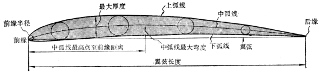      
图(20) 翼型各部分的名称

翼型各部分的名称如图(20)所示。一般翼型的前端圆钝，后端尖锐，下表面较平，呈鱼侧形。前端点叫做前缘，后端点叫做后缘，两端点之间的连线叫做翼弦。

其中影响翼型性能最大的是中弧线的形状、翼型的厚度的分布。

* 中弧线是翼型上弧线与下弧线之间的内切圆圆心的连线。
* 翼弦是指连接翼型中弧线前后端点的直线，它是翼型的一条基准线。

翼型前缘半径决定了翼型前部的“尖”或“钝”，

* 前缘半径小，在大迎角下气流容易分离，使模型飞机的稳定性变坏；
* 前缘半径大对稳定性有好处，但阻力又会增加。

如果中弧线是一根直线，与翼弦重合，那就表示这翼型上表面和下表面的弯曲情况完全一样，这种翼型称为对称翼型。普通翼型的中弧线总是弯的，S翼型的中弧线是横放的S型.

翼型的厚度、中弧线的弯度、翼型最高点在什么地方等通常都是用翼弦长度的百分数来表示的。

中弧线最大弯度用中弧线最高点到翼弦的距离来表示。
中弧线最高点的翼弦的距离一般是翼弦长的4%~8%。
中弧线最高点位置同机翼上表面边界的特性有很大关系。
竞速模型飞机翼型的中弧线最高点到前缘的距离一般是翼弦的25%~50%。

翼型的最大厚度是指上弧线同下弧线之间内切圆的最大直径，一般来说，厚度越大，阻力也越大。而且在低雷诺数情况下，机翼表面容易保持层流边界层。因此，竞速模型要采用较薄的翼型。翼型最大厚度一般是翼弦的6%~8%。但是，线操纵特技模型飞机例外，它的翼型最大厚度可以达到翼弦的12%~18%。翼型最大厚度位置对机翼上表面边界层特性也有很大影响。

## 翼型命名：

适合于模型飞机上使用的翼型现在已有百种以上，每种翼型的形状都各不相同。为了确切地表示出每种翼型的形状，现在都用外形座标表表示。如NACA2412，第一个数字2代表中弧线最大弧高是2%，第二个数字4代表最大弧高在前缘算起40%的位置，第三、四数字12代表最大厚度是弦长的12%，所以NACA0010，因第一、二个数字都是0，代表对称翼，最大厚度是弦长的10%，但要注意每家命名方式都不同，有些只是单纯的编号。

因为翼型实在太多种类了，一般人如只知编号没有座标也搞不清楚到底长什么样，所以在模型飞机界称呼翼型一般常分成以下几类:
 
 
一般而言，S型机翼的升力最大，凹凸型次之，平凸型又次，双凸型再次，对称型机翼没有升力。

## 全对称翼：

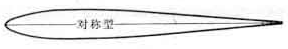    
图(1) 全对称翼

如果中弧线是一根直线，与翼弦重合，那就表示这翼型上表面和下表面的弯曲情况完全一样，这种翼型称为对称翼型。

上下弧线均凸且对称。
3D花样特技模型直升机的旋翼模型就是这样的。

对称型机翼没有升力,没有升力怎么飞行？采用对称型机翼的飞机一般都是特技机，试想倒飞时有向下的力是不是有点滑稽？那么没有升力它怎么飞呢？

其实飞行物有许多解决方案，譬如人造卫星掉不下来是因为它的速度。我们知道地球是圆的，人造卫星在天上飞，一面飞一面掉，它每秒飞过7.9公里，掉下来的高度正好等于地球弯下去的高度，所以人造卫星就绕地飞行了。

当然，模型飞机飞不了那么快，但是我们只要让它抬起一点头，它就会向前飞行了。这就是“斜面原理”，

斜面原理有三条，一是要足够轻，二是如果不够轻就要足够快，三是要掌握好角度与推力的关系。

## 半对称翼

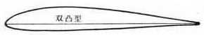    
图(2) 半对称翼

上下弧线均凸但不对称。
有的3D花样特技模型直升机的旋翼模型也是这样的。

## 克拉克Y翼

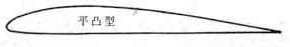    
图(3) 克拉克Y翼

下弧线为一直线，其实应叫平凸翼，有很多其他平凸翼型，只是克拉克Y翼最有名，故把这类翼型都叫克拉克Y翼，但要注意克拉克Y翼也有好几种。

平凸翼的最佳翼型是“克拉克”，它的最高点在机翼前缘的30%到45%处。

## S型翼

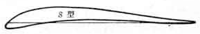     
图(4) S型翼

中弧线是一个平躺的S型，这类翼型因攻角改变时，压力中心较不变动，常用于无尾翼机。

## 内凹翼

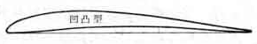      
图(5) 内凹翼

下弧线在翼弦线上，升力系数大，常见于早期飞机及牵引滑翔机，所有的鸟类除蜂鸟外都是这种翼型。

鸟的翅膀在飞行使羽毛能够展开，并且翅膀下面是内凹而上方是凸起的。

## 其他特种翼型

### 层流翼型 弯后缘翼型

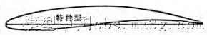      
图(6)      
 
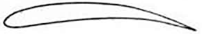      
图(7)

如图(6)、图(7)的最大厚度点在60%弦长处的“层流翼型“，下表面后缘下弯翼增大机翼升力的“弯后缘翼型” ，；

### 平板式后缘翼型

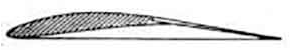    
图(8) 平板式后缘翼型

图(8) 为了改善气流流过机翼尾部的情况，而将翼型尾部做成一块平板的“平板式后缘翼型”，；

### 鸟嘴式前缘翼型

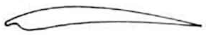     
图(9) 鸟嘴式前缘翼型

图(9) 头部处比一般翼型多出一偏薄片，作为扰流装置以改善翼型上表面边界层状态的“鸟嘴式前缘翼型”

### 增强翼型

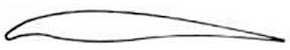      
图(10) 增强翼型 

图(10) 的下表面有凸出部分以增加机翼刚度的“增强翼型”等。

# 机翼形状

当然机翼还有形状问题。譬如有矩形翼、三角翼和梯形翼等等。那么哪种机翼的升力最大呢？根据台湾某大学研究小组的实验结果，全梯形翼的升力最大。你看真正的战斗机，无论是美国的F22、俄罗斯的T50还是中国的J20的机翼都是接近于全梯形的。

当然，也不是说升力越大就越好，如果追求速度，倒是SU27的后掠翼好些。

