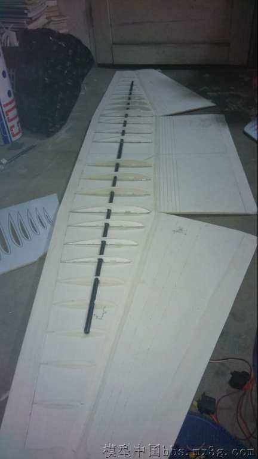

折纸法制作运7

出处： <http://www.mx3g.com/forum.php?mod=viewthread&tid=448277>

制作过程。

说一下飞机的配置等等：
飞机翼展2000mm，
做出来之后加两块4S2200mah电池2400g,
动力双发2217kv1250电机架
1060*3桨飞之前把飞机竖起来
推重比1：1.

首先是图纸的打印，我们这边广告店实在太贵了40一平米，实在接受不了 ，于是就在网上打了一份8块钱一平米，邮费6块钱，在本地广告店买了两块kt板40块钱，好心的老板娘还帮我把写真贴上了 ，这可生了我不少功夫。

接下来就是要把这些零件仔细的切下来.

## 机身

先做的是飞机的中段，先用尺子把两边标记好，用没水的笔画上道道，这样就可以折了.

建议大家把每个隔框都复制一份，机身和发动机舱都一节一节做，左后粘的时候在隔板上涂上胶水就行了，做的时候要注意不要给封死了，不然里面的电子设备没办法安装，还要注意接缝，我因为头一次做折纸也没太注意，结果做的机身不太好看。

把机身的每个部分都做好之后就可以在尾部安装升降舵和方向舵的舵机了

## 机翼

鸡翼的制作要格外的仔细，不要做扭了，不然就没法爽飞了，鸡翼的加强我用的是1.5米长10mm的碳杆，采用的是整个鸡翼拆卸，避免鸡翼做扭。把翼肋均匀的分布在鸡翼上，鸡翼的后缘的kt要削薄一点，这样才能做出刀锋般的副翼来，在相应的地方抹上泡沫胶把机翼折起来并用重物压住。

等待1~2天让胶水干透就可以取出来了。

注意要在折鸡翼之前把副翼，襟翼，（我还留了拉烟线）的舵机还有电机的电线留好。并串出来。如图

发送机舱的制作和机身类似就是在安装电机的那段要加强如图：

接下来就是做机翼和机身连接的部分了，我在鸡翼的下端固定了两根8mm 碳杆，在机身中段的隔板上固定了两小段8mm 碳杆，使他们在一条直线上，能够使6mm碳杆把他们穿在一起，这样机翼和机身就能够自由拆卸了。

做好之后加了电机电调桨称了下重量还可以

起落架的制作依然用的8mm和6mm的碳杆，加棉线点101胶水固定，弹簧是用做拉杆的钢丝捏的 

前起落架要做转向结构。 最后就是把个个部分粘起来了还有就是把拉杆都接上

此外我还做了弹仓容积挺大的用两个舵机控制

整个飞机装好就是这个样子了，调试好就可以试飞了！！

