赛斯纳 组装参考

## 整体
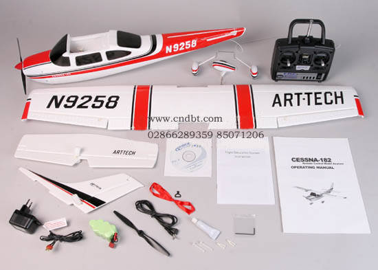

## 轮子
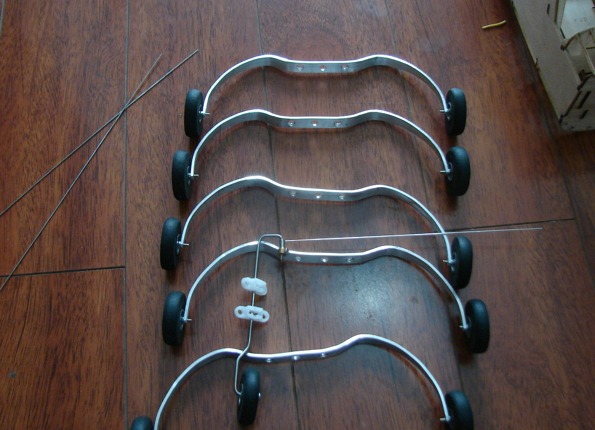
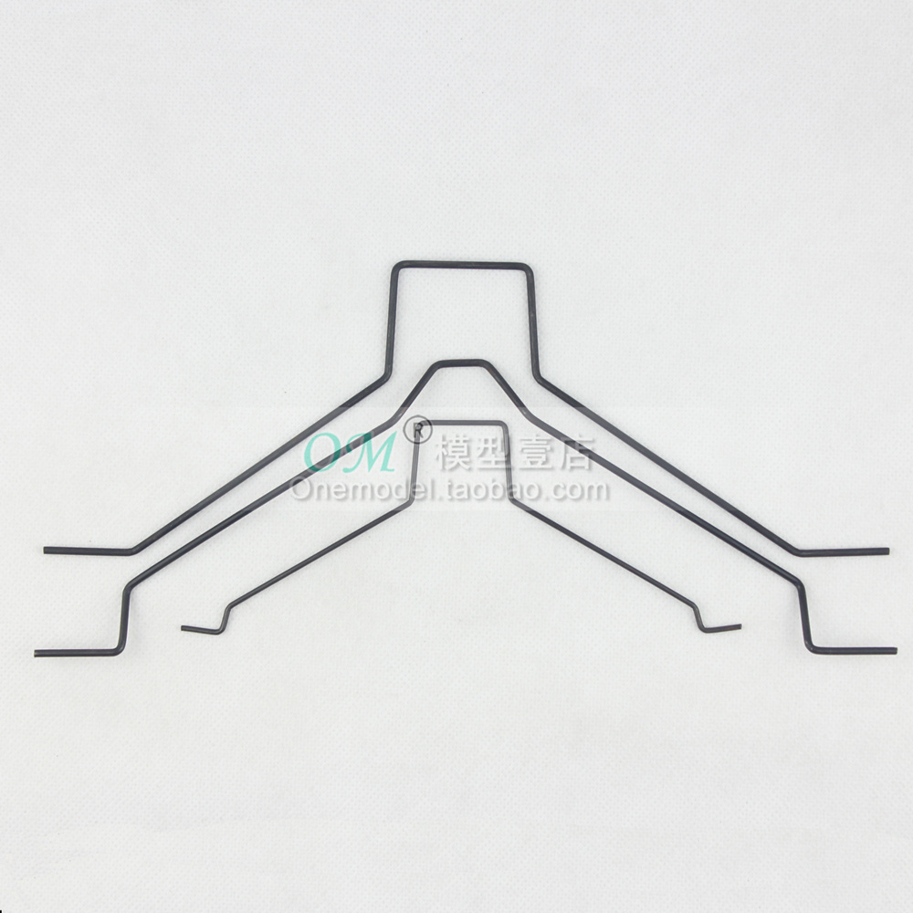

<http://bbs.5imx.com/viewthread.php?tid=562178>

经过好几个夜晚的赶制我的马头版塞斯纳终于完工，该机用折纸法制作，翼展1.3米，起飞重量980克，看起来重了点，由于降落不是很好老是损坏前起落架，于是搞个后三点的起落架

花了30元搞的写真图纸
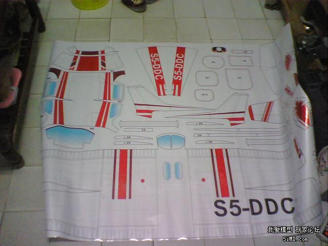

贴在KT板上切出来
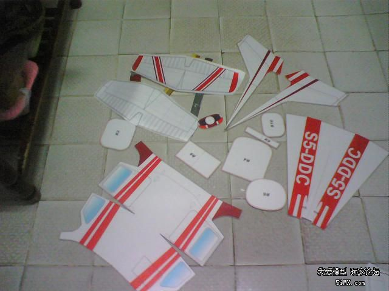

粘制机身
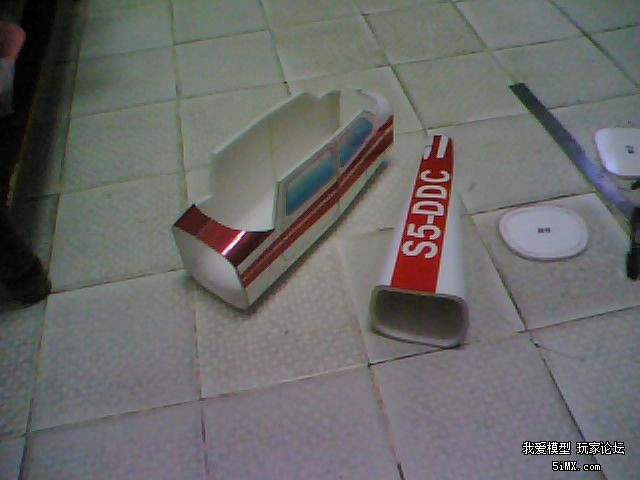
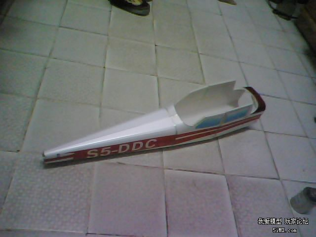

机身对接
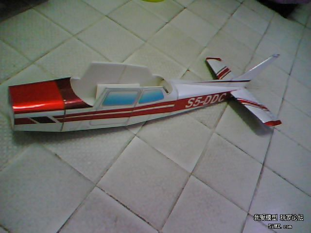

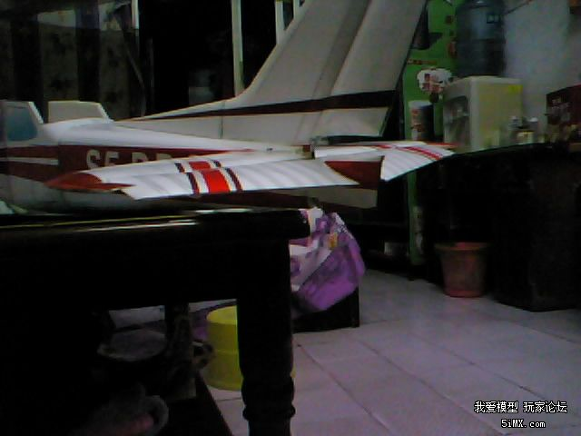

机翼制作完成
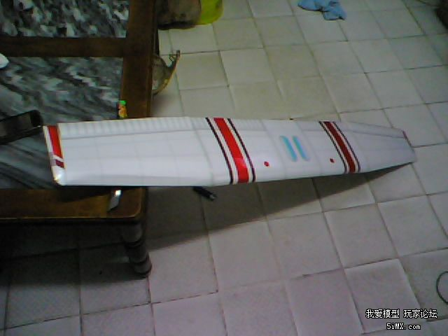

假组装一下
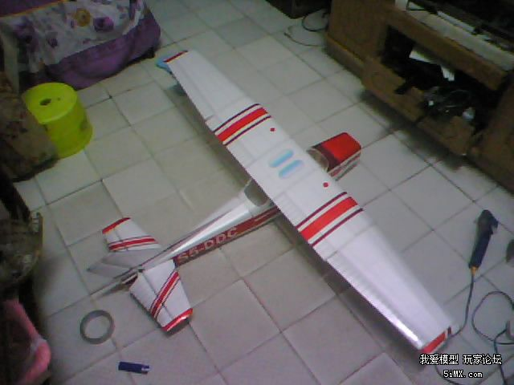

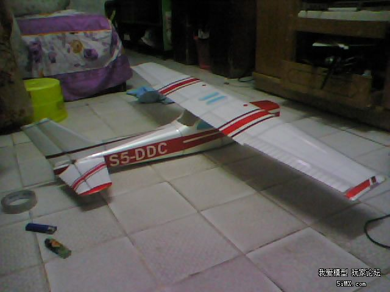

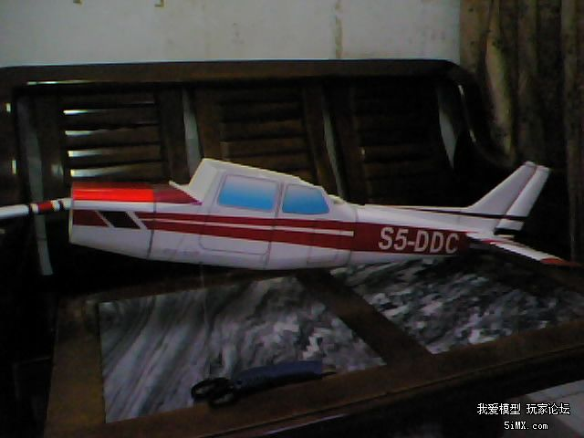

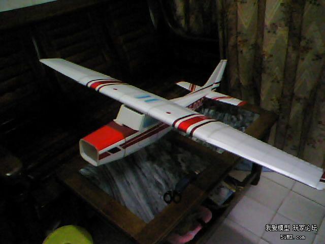

装上电机

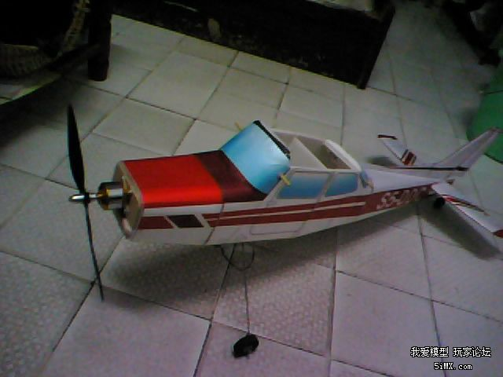

装上头罩
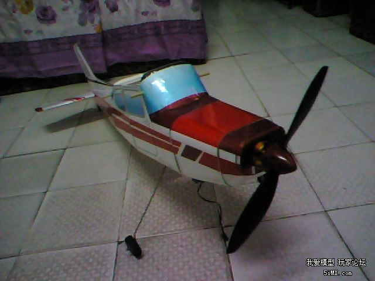

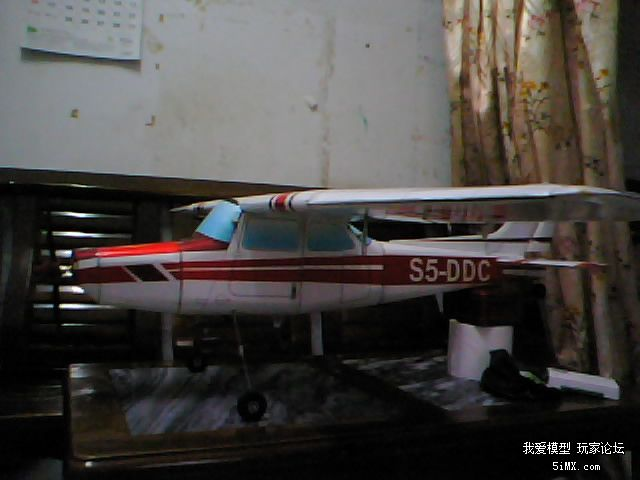

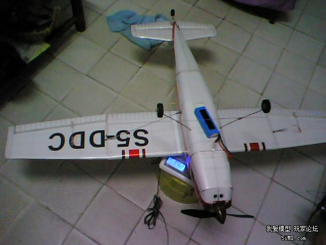

