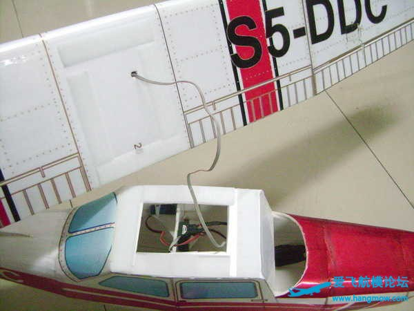

# 折纸法造塞斯纳

折纸法做遥控模型是参考了静态纸模型的制作方法，用KT板和KT写真膜代替纸，用透明胶带和泡沫胶做粘合剂，并对部分结构适当的进行加强从而做出外观美观，性能优良的遥控模型的方法。

出处：[折纸法造塞斯纳](http://www.hangmow.com/thread-1744-1-1.html)

相对传统方法具有制作简单，外观免涂装，防水耐摔的特点。

适合模型爱好者自己制作。

KT板和KT写真膜在一般的广告店是用来制作室内展板的材料，KT板很轻，但强度不足，易折易断，有KT写真膜覆盖在表面强度就会大大加强。

下面是用折纸法制作赛斯纳172模型

## 一、图纸的处理

首先在电脑上用photoshop图像处理软件设计好图纸，并处理出自己喜爱的涂装方案。

图纸的尺寸一般根据KT板的宽度设计成90厘米高。

      
图1     

若按图1方式摆放零件，图纸为142厘米，飞机的翼展为1.3米。

设计好的图纸需先用打印机打印一份用普通厚纸制作一个纸模型以验证图纸的精度，并根据制作的纸模型对图纸做进一步的修改。

修改好图纸后交广告店打印成KT写真膜，一般每平方十几元。

## 二、KT写真膜与KT板的粘贴

KT写真膜有三层，最上面是防水层，中间是图案层，背面有背胶与薄膜层，将背面薄膜撕下便可将写真膜粘在KT板上。

粘贴时要边撕边粘，切不可将整个背膜都揭下粘贴（图2）。

粘贴前将零件沿轮廓线外缘剪下，粘在KT板上后，再用小美工刀小心精确裁切（图3）。

## 三、机身的制作

裁剪下来的零件要根据机身外形卷曲成各种形状，卷曲前需在KT板背面用铅笔划线，以形成折痕，线的间隔越短，外观越平滑（图4）。

机身剖面使用隔板定形，将隔板边缘和机身边缘都削成45°斜口以便准确粘贴（图5）。

机身座舱部位的卷曲较为复杂，划线折痕可参考图6。

折痕位置的确定一方面来自前期用纸做的小模型，另一方面来自机身隔板的形状，机身处在隔板曲线部分需画折痕，直线部位不需要。

        
（图7）      
图7为粘结好的机身座舱部位，所有的接缝处都先用泡沫胶（不腐蚀KT板）粘接，然后用透明胶带在外壳接缝外再粘一层。

在将机头和座舱部位粘接之前用电器包装泡沫雕刻一块和机头内部形状吻合的泡沫块，以便后面安装电机座和电池盒。

机身各段卷好后粘隔板定型，隔板需复制一份，粘在一起的机身前段和后段都要用隔板定型。图9 中机头最前那小段等电机电池装好后再粘。

## 四、机翼的制作

机翼贴膜后仍然要在背面画折痕，根据翼肋的形状，弯曲严重的地方折痕深间隔短。

如图10上半部分是机翼的下面，下半部分折痕较多的是机翼的上面。

为了让机翼的后缘比较尖锐，需用美工刀把上下机翼的后缘削薄，削的时候用玻璃茶几和钢尺限位就不会多削或少削。

翼肋在裁切的时候要扣除KT板的厚度，在机翼一端和机翼上下面配合好后定型，再复制13份等距粘贴在机翼的内下面。

(图12)

如图12先粘翼肋下面，翼肋前缘的下部后粘，泡沫胶要在翼肋和机翼上都涂，快干后按压在一起。

翼肋中间的孔洞是用来穿插加强机翼的1米长4毫米直径中空碳纤杆的。

将翼肋上面和机翼内上面翼肋粘接位置都涂胶，上下机翼面合并时需放在平整的玻璃茶几上进行，对齐边缘粘贴防止机翼扭曲变形。

(图13)

副翼舵机需用Y线控制，Y线可用电脑数据线或网线内芯自己焊接，原理如图13。

Y线两端要留够长度，插头由机翼中间穿出（图14）。

机翼外段为梯形，为了省事只将翼肋的关键高度垫撑三条KT板，由翼肋处到翼尖厚度逐渐降低。

   

完成后的外段机翼穿插Y线到舵机位置后，就可以粘接到机翼中段了，接缝处要多贴两层透明胶带以增加强度。

机翼完工后在机翼外段加工副翼，副翼的切割加工过程见图18，副翼舵角采用商品舵角，用适当长度钢丝连接舵角和舵机摇臂，舵机压入后将原先切割下来的机翼蒙皮用透明胶布覆盖在舵机安装面。

在舵机摇臂位置开长孔使转动灵活（图19、20）。

## 五、尾翼的制作

水平尾翼上下面贴膜后沿边线裁切好。

然后将前缘后缘削薄等待粘贴，削切面积如图21。

在水平尾翼前部中间夹粘四片布条做铰链。水平尾翼的两侧舵面的中间夹粘W形钢丝以确保两侧舵面转动一致（图22）。

水平尾翼边缘用透明胶布粘接，手法如图23，在一面粘好透明胶带，用拇指将两面压紧的同时把胶带粘到另一面。

这样做出的尾翼边缘圆滑外形美观。图24为尾翼完成后的效果图，水平尾翼在机尾的插槽参见图纸，开槽时确保尾翼水平，并和主机翼保持平行。

垂直尾翼的零件如图25，也需削薄边缘并加铰链。

先把垂尾前部直接粘接在机尾上部，然后如图26将舵面前缘用泡沫胶粘好，用透明胶带包裹前缘后再合并。

最后完成效果如图27。

## 六、设备仓及起落架的构造和强化

主起落架使用雨伞的粗钢丝制作，用三层2毫米的桐木片做起落架座，在中间一层木片开槽固定钢丝，粘贴在R4隔板上（图28），在R4隔板前后粘贴起缓冲和强化作用的泡沫块（图29）。

座舱侧面由于要支撑机翼所以需用形状符合的KT板再粘一层以增加强度（图30）。

因要安装前起落架电池电机等，所以要在第二段机头部位填充整块泡沫（图9）。

在下部挖一孔以通过电机电线（图31箭头部位），此孔可适当开大些，以便螺旋桨可以将冷空气鼓入电池盒冷却电池。

在前起落架前，垂直机身位置再挖一电池仓。并用2毫米木片制作电池盒用胶粘入泡沫仓中，电池盒口粘接魔术贴以便取放固定电池（图32）。

电池仓的位置由飞机的重心决定。可根据自己制作的飞机实际情况调整。

前起落架座也需固定于此块泡沫中，起落架钢丝仍由雨伞钢丝制作，在上部折成L形并用2毫米木片固定，以防止起落架偏转，做出如图33的十字结构，在泡沫上开槽，再在木片上涂泡沫胶后压入。

电机座使用双层2毫米木片制作，用泡沫胶粘在机身隔板上便可。完成后效果如图34。

起落架的整流罩部位零件比较小，在折叠粘贴的时候需要将接缝处的KT板适当削切以使表面KT写真膜吻合，不露出白色的KT板（图35）。

为了固定起落架整流罩在起落架钢丝外部制作一三角形钢丝框（图36），

然后用泡沫胶和透明胶带固定整流罩在框架上便可（图37）

为了维修的方便机翼做成可拆卸形式，如图38、39把座舱改造成一机翼平台，加横向隔板，用小块KT板垫平，并用KT写真膜包裹，机翼和座舱之间用魔术贴粘贴（图39），

再在前后挡风玻璃处用透明胶带将机翼固定在座舱上便可。前挡风玻璃用KT板做成前凸的盒状，上端与机翼前缘相吻合（图40）。

接收机用双面胶粘贴在座舱隔板上（图43），

升降舵和方向舵舵机用泡沫胶粘在座舱侧面并在周围用泡沫块限位，舵机拉杆可用碳纤杆或竹条与钢丝制作，从水平尾翼上放传出，将机身穿孔适当扩大以使拉杆灵活。

舵角使用成品塑料舵角。如图42左侧为尚未装好的方向舵拉杆，右侧为已连好舵角的升降舵拉杆。

最后为机翼安装机翼撑杆，由于机翼已经加强，撑杆无需用力，只要用KT写真膜包裹木片或竹条粘在机翼和机身之间便可。

该机翼展有1.3米，飞机的动力可选择2830或2217等型号拉力较大的无刷电机。桨使用1047或1147成品塑料桨。电调使用30A无刷电调。舵机使用普通9克舵机。

至此一架可爱的赛斯纳飞机便完工了。

图纸：需要强调的是图纸中的翼肋可能比较大，请削去一圈试好了再粘.

