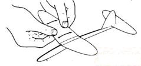

# 竞技机型1

外形：     

## 图纸

## 制作方法

裁剪时需注意。周围留下约 2~3 毫米待接合时裁剪用。

剪裁时需极小心。以免重量不平均 . 及摺伤纸张。

裁剪好 OK 的部份。 延虚线处利用尺规摺成 90º 直角。

依顺序使用相片胶 ( 施敏打硬 ) 黏合机身 . ( 外侧两片暂不黏 )

使用胶水时需注意涂抹均匀。

利用其他乾净纸张 . 将机身放置中间 . 加力挤压 . 约 30~60 秒鐘即可拿出.

利用废纸张製作纸角架 . 将机身放置上方待干 . 约 5 分钟。

利用书本重量加压 . 使机身黏合平直不变形 . 约 45~60 分鐘.

先将 A 剪好 . 再将 B 涂抹胶水 .对準中心现黏合主翼 . 然后利用美工刀割下多餘部份。

利用剪刀背修饰机身凹凸面。

用尺压住主翼中心线 . 一边向上抝摺角度。

组合 机身.主翼.尾翼. 切记黏合时 . 箭头朝向机首 . 并置中对正。

机身.机翼组合时 . 需小心黏合不能有空气间隙 .

主翼需要调整幅度 . 飞行会更加好 . 但摺调主翼需经验 . 请小心注意 . 避免将主翼摺出痕跡 . 造成败笔 . 前功尽弃

向两侧慢慢外拉 . 技巧

安装铅片 . 黏合机身

调整重心利用迴纹针配重调整

上漆可防止变形及防水 . 切记禁止水性任一种涂料

目视调校完成

