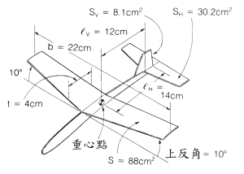
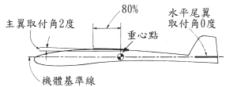
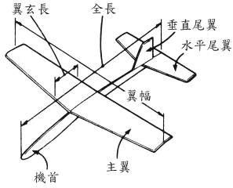

# 纸飞机滑行性能

本文出处：

[列表](http://blog.sina.com.cn/s/articlelist_1413320887_3_1.html)

[飞机模型设计教学解说图档1、2](http://blog.sina.com.cn/s/blog_543d90b701000bqh.html)

[飞机模型设计教学解说图档3、4](http://blog.sina.com.cn/s/blog_543d90b701000br1.html)

## 如何使纸飞机飞得好

要让纸飞机飞得好 , 需具备下列二点 :

1. 和滑翔曳一样 , 纸飞机不产生动力 , 所以首先必须具有良好的滑行性 (gliding performance) , 所谓良好的滑行性就是指滑行比愈大 (glidde ratio) 或沉降率愈小 (sinking rafe) , 稍后将再详加说明 .

2. 安定性良好的纸飞机 , 在飞行中即使机身倾斜 , 也能回正确的姿势而继续的飞行

具有以上二点 , 纸飞机便能在高空中完美地滑行 , 就算在稍有乱流的情况下 , 也能确定做长距离或者做长时间滞留空中的飞行 .

## 如何使纸飞机具有良好的性能

为纸飞机各部位的名称。

主翼扮演着在空中支持机身的重要角色。

机翼的横切面称为翼断面 (Wing Secfion) 或翼型 (Aerofil Section) .

翼断面形状为薄翼  , 翼断面的基准线称为翼弦线 (Chord Line) 其长度称翼弦长 (Chord Lengfh) .

如下图所示迎面吹来的风向与翼弦线所成的角称为迎角 (angleofaffack) . 原本只在飞机制作或制图时方便起见才在机身画出的基准线它与翼弦线形成的角称为取付角 (angle of seffing) 取付角是固定于机身 , 而迎角会随着飞行的姿势而变化 , 所以二个角度通常不会相同

