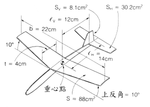
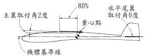
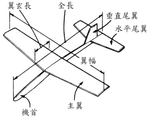
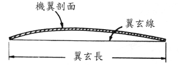

# 国际比赛竞技机设计入门
本单元将教您 ( 国际比赛竞技机 ) 设计入门

本文出处：

[列表](http://blog.sina.com.cn/s/articlelist_1413320887_3_1.html)   
[飞机模型设计教学解说图档 性能](http://blog.sina.com.cn/s/blog_543d90b701000bqh.html)   
[飞机模型设计教学解说图档 设计方法](http://blog.sina.com.cn/s/blog_543d90b701000br1.html)

## 纸飞机简易设计图

    
图1 纸飞机简易设计图

    
图2 纸飞机简易设计图 取付角

## 如何使纸飞机飞得好

要让纸飞机飞得好（远、稳定） , 需具备下列二点 :

1. 和滑翔曳一样 , 纸飞机不产生动力 , 所以首先必须具有良好的滑行性 (gliding performance) , 所谓良好的滑行性就是指滑行比愈大 (glidde ratio) 或沉降率愈小 (sinking rafe) , 稍后将再详加说明 .

2. 安定性良好的纸飞机 , 在飞行中即使机身倾斜 , 也能回正确的姿势而继续的飞行.

具有以上二点 , 纸飞机便能在高空中完美地滑行 , 就算在稍有乱流的情况下 , 也能确定做长距离或者做长时间滞留空中的飞行 .

## 如何使纸飞机具有良好的性能

图3为纸飞机各部位的名称。
主翼扮演着在空中支持机身的重要角色。

        
图3 纸飞机各部位说明

机翼的横切面称为翼断面 (Wing Secfion) 或翼型 (Aerofil Section) .

     
图4 机翼的翼型

图4 翼断面形状为薄翼  , 翼断面的基准线称为翼弦线 (Chord Line) 其长度称翼弦长 (Chord Lengfh) .

如下图5 所示迎面吹来的风向与翼弦线所成的角称为迎角 (angle of affack) . 

     
图5 主翼与机身迎角面

原本只在飞机制作或制图时方便起见才在机身画出的基准线它与翼弦线形成的角称为取付角 (angle of seffing) 取付角是固定于机身 , 而迎角会随着飞行的姿势而变化 , 所以二个角度通常不会相同

    
图2 纸飞机简易设计图 取付角

如图6 所示当纸飞机在空中滑行与风相互碰撞会产生一风压力 , 

     
图6 取付角与迎角的说明

如图5 所示 , 而此风压力会分解成扬力 (升力:lift) 与抗力 (阻力:drag) 两者的比率称为扬抗比 , 扬抗比愈大 , 也就是滑行性良好的机翼 , 它的扬力值应愈大 , 抗力应愈小。

下图7 所示 , 当纸飞机滑行时 , 其滑行距离与高度的比称滑空比 . 在相同高度H情况下 , 滑空比如果愈大 , 飞机可滑行得愈远 . 因此 , 滑空比等于飞机全体的扬抗比 (并非指前述主翼的扬抗比,而是包括机身等其它空气的抵抗力的扬抗比) 

")     
图 7 滑行能力与杨抗比(扬抗比=升力比)

要如何取得适当的机体扬抗比 ? 第一选择扬抗比好的主翼翼断面 如下图 8 所示薄型弯曲的翼型 , 它制作方法非常简单 , 如同前文说明 , 以手指小心地将本呈平面的翼弯曲 (camber) 即可 , 另外机身以细长形为佳 , 而起落 装置 . 支撑物 . 诸如此类的突出部份则尽可能减少。

    
图 8 纸飞机最好的翼面型

如下图9 所示 , 纵横比 = 翼幅 / 翼弦长 , 纵横比愈大 , 表示机翼愈长 , 其对于空气 抵抗则愈小 , 所以滑翔机或作长距离飞行的飞机通常就是采较为细长的机翼 . 

     
图 9 纵横比

但对速度慢 , 机体又小的纸飞机来说 , 细长的主翼并不能如上所说能产生空气抵抗小的效果 , 倒不如采纵横比约 5-6 . 

制作更轻 , 更坚固地飞机更为理想机翼 的扬抗比会随着迎角而改变 , 如下图10 , 曲线A为机翼的扬抗比 , 当迎角约3-4度 时扬抗比最大 , 实际上 , 扬抗比还包括机身等部份 , 所以较机翼扬抗比多1-2度 , 也就是在迎角5-6度时 , 飞机全体扬抗比为最大 , 而此时的角其滑空比也最好。

     
图 10 迎角与升抗比下降变化

所谓沉降率是指飞机在滑空时 , 每秒以多少公尺逐渐下降的比率 , 换句话说 要延长飞机在空中滞留的时间 , 就必须减小沉降率 . 

图(10) 所示 , 迎角 6-7 度时 沉降率为最小 
翼面负荷 = 机体重量 / 主翼面积机体愈重 , 主翼面积愈小 , 则翼面负荷愈大 , Lockheed F-14就属此类 , 翼面负荷愈大的飞机滑空速愈快 , 也因为如此 , 沉降率也相对增加 , 

反之 , 轻型飞机及 滑翔机它的主翼面积大 , 机体又轻 , 所以翼面负荷小 , 沉降率相对减小 , 而能在 空中做长时间的飞行 . 

而纸飞机的设计也是一样 , 滞空用的机体需将翼面负荷 降低 , 即翼面大 , 轻机体设计基准。
