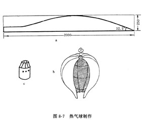

# 热气球

热气球是利用热空气比冷空气轻的原理制作的航空器。

热气球分为球体和加热器两部分。

球体用来储存热空气，用又轻又薄的塑料薄膜或打字纸制作。

热气球的底面有个进气口，下面吊着加热器，加热气球内的空气，使球内的空气密度小于外面的空气密度，这样，热气球就会慢慢升空。

## 材料

塑料薄膜、钢丝、日光灯启辉器、棉花、酒精等。

## 制作方法

用白纸板按图8-7（a）制成弧表样板。

将塑料薄膜对折，按样板剪8片，把8片塑料薄膜拼烫在一起。

在顶部烫上一个圆形塑料薄膜。

把钢丝围成一个圆圈，穿在球体底的边缘，撑开加热口。

在启辉器壳上开些小洞作为输氧孔，然后在壳口上剪几个锯齿形缺口，向里收缩。

在启辉器壳壁周围对称钻三个小孔，将三根钢丝穿入折好，另一端则钩在球体口的钢丝上。

## 热气球放飞

热气球放飞应在无风的地方，附近应避开易燃物品。

放飞时，先用竹杆把热气球挂起来，使热气球自然下垂。

先在加热器内放入干棉花，然后倒入酒精，点燃酒精，加热球体内空气，热气球就会慢慢鼓起，当热气球空气达到一定温度时，热气球就会离地升空。

为控制热气球上升的高度，可在热气球下系一根细绳，另一端固定在地面上。
热气球也可以进行比赛，方法是规定同样多的燃料，看谁的热气球在空中停留的时间长，谁的热气球升得高。