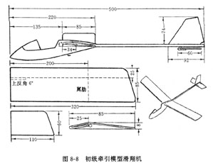

# 初级牵引模型滑翔机

牵引模型滑翔机是用一根线像放风筝一样把模型飞机牵引上升，到达一定高度，牵引线脱离模型，飞机自由滑翔。

## 制作

图8-8是一架纸木结构初级牵引模型滑翔机，结构比较简单，飞行性能较好。

该机的机翼采用吹塑纸制作，机身用松木制作。

制作方法与手掷模型飞机等方面相同。适合于高年级学生制作。

## 试飞

初级牵引模型机的试飞，要先进行手投试飞，然后进行牵引试飞。

牵引试飞时，将细线的一端拴在机身下的小钩上，另一端由放飞者控制。

牵引时要找块平坦的地面。

开始牵引时，一人举起模型飞机，另一人牵线，两人同时向前奔跑，当举模型的人感到有一定的升力时就放手，模型飞机开始上升，达到一定高度时，牵线人放松牵引线，模型飞机就会自动脱钩，进入滑翔飞行阶段。