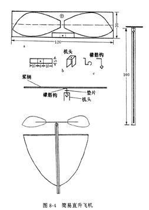

# 简易直升飞机

直升飞机是利用旋转着的螺旋桨产生力而升空的。

简易直升飞机，利用橡筋带动螺旋桨，机身上的阻力板，用来平衡螺旋桨的反作用力矩。

这种模型飞机与真直升机有很大的区别，但产生升力的原理是一样的。

## 材料

竹丝一根、薄竹片一根，桐木条一根，易拉罐、大头针、橡筋圈、薄纸。

## 制作方法
用易拉罐皮按图8-4（a）剪出两片桨叶、一个机头架和一个垫片。

并按图中要求打好扎。将机头架弯成图8-4（b）形状。
（本章图中未标明的长度单位均为毫米）。

将竹丝磨光滑做桨柄，用刀片将竹丝两端割开25毫米，然后插入两片桨叶，并涂上胶水。

将大头针弯成图8-4（c）形状做橡筋钩，然后将桨柄、橡筋钩、垫片、机头架等组装在一起。

将薄竹片粘在机身上，上面留出25毫米，然后将薄纸糊在竹片和机身上。

将两根橡筋圈接起来，套入橡筋钩里，简易直升机就做成了。

## 试飞

用左手捏住机身，右手食指拨动桨柄，绕紧橡筋。

待橡筋绕紧后，松开左手，直升机就能升空了。