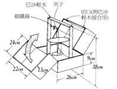

## 保养

### 固定式

拉一条细线 . 上撺过夹子 . 将纸飞机机首朝上夹住 . 

如下图(1)

      
图(1) 固定式保养 

### 携带式

制作一个保护箱 . 便可到处行走也不怕纸飞机受损 . 
如下图(2)

       
图(2) 携带式保养

## 修护方法

### 机首  

修护机首时. (使用的胶水为相片胶) 用熨斗加热于机首 . 
便可使相片胶化开 . 再将机首粘合既可 . 如下图.

      
图(3)  维护机首

### 机身机翼

利用剩余纸张当修护用纸 . 将受到损伤处 . 两面粘合即可 . 如下图。

      
图(4) 维护机身机翼

最佳飞行场地选择 : 
· 选择最适合飞行的地点 . 可以使纸飞机飞行能力提升 . 滞空时间加长 . 草原地是最佳地点 . 如下图说明 

## 放飞

### 最佳飞行场地选择

选择最适合飞行的地点 . 可以使纸飞机飞行能力提升 . 滞空时间加长 . 草原地是最佳地点 . 如下图说明:

     
图(5) 不同区域的气流 

     
图(6) 草地气流

场地的大小 . 最小 100 * 100 平方公尺 . 适合场地为 300 *3 00 平方公尺 . 如学校运动场 . 棒球场 . 足球场...等.

### 最佳时间选择

(如下图)上午9时-12时为最佳时刻 . 12时-15时风速较高 . 较适合弹射飞行 . 其它为普通

     
图(7) 最佳放飞时间