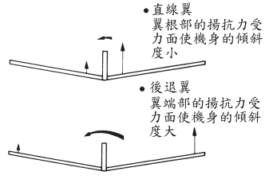

# 国际比赛竞技机设计入门
本单元将教您 ( 国际比赛竞技机 ) 设计入门

本文出处：

[列表](http://blog.sina.com.cn/s/articlelist_1413320887_3_1.html)   
[飞机模型设计教学解说图档 性能](http://blog.sina.com.cn/s/blog_543d90b701000bqh.html)        
[飞机模型设计教学解说图档 设计方法](http://blog.sina.com.cn/s/blog_543d90b701000br1.html)       
<http://www.tech-domain.com/forum.php?mod=viewthread&tid=325&digest=1>

## 纸飞机简易设计图

    
图1 纸飞机简易设计图

    
图2 纸飞机简易设计图 取付角

## 如何使纸飞机飞得好

要让纸飞机飞得好（远、稳定） , 需具备下列二点 :

1. 和滑翔曳一样, 纸飞机不产生动力, 所以首先必须具有良好的滑行性 (gliding performance), 所谓良好的滑行性就是指滑行比愈大 (glidde ratio)或沉降率愈小(sinking rafe) , 后文详加说明。

2. 安定性良好的纸飞机 , 在飞行中即使机身倾斜 , 也能回正确的姿势而继续的飞行.

具有以上二点 , 纸飞机便能在高空中完美地滑行 , 就算在稍有乱流的情况下 , 也能确定做长距离或者做长时间滞留空中的飞行 .

## 如何使纸飞机具有良好的性能

下图(3)为纸飞机各部位的名称。
主翼扮演着在空中支持机身的重要角色。

        
图3 纸飞机各部位说明

机翼的横切面称为翼断面 (Wing Secfion) 或翼型 (Aerofil Section) .

     
图4 机翼的翼型

图(4)翼断面形状为薄翼  , 翼断面的基准线称为翼弦线 (Chord Line) 其长度称翼弦长 (Chord Lengfh) .

如下图(5)所示迎面吹来的风向与翼弦线所成的角称为迎角 (angle of affack) . 

     
图5 主翼与机身迎角面

原本只在飞机制作或制图时方便起见才在机身画出的基准线它与翼弦线形成的角称为取付角 (angle of seffing) 取付角是固定于机身 , 而迎角会随着飞行的姿势而变化 , 所以二个角度通常不会相同

    
图2 纸飞机简易设计图 取付角

如图(6)所示当纸飞机在空中滑行与风相互碰撞会产生一风压力 , 

     
图6 取付角与迎角的说明

如图(5)所示 , 而此风压力会分解成扬力 (升力:lift) 与抗力 (阻力:drag) 两者的比率称为扬抗比 , 扬抗比愈大 , 也就是滑行性良好的机翼 , 它的扬力值应愈大 , 抗力应愈小。

下图(7)所示 , 当纸飞机滑行时 , 其滑行距离与高度的比称滑空比 . 在相同高度H情况下 , 滑空比如果愈大 , 飞机可滑行得愈远 . 因此 , 滑空比等于飞机全体的扬抗比 (并非指前述主翼的扬抗比,而是包括机身等其它空气的抵抗力的扬抗比) 

")     
图 7 滑行能力与杨抗比(扬抗比=升力比)

要如何取得适当的机体扬抗比? 第一选择扬抗比好的主翼翼断面 如下图 (8) 所示薄型弯曲的翼型 , 它制作方法非常简单 , 如同前文说明 , 以手指小心地将本呈平面的翼弯曲 (camber) 即可 , 另外机身以细长形为佳 , 而起落 装置 . 支撑物 . 诸如此类的突出部份则尽可能减少。

    
图 8 纸飞机最好的翼面型

如下图(9)所示 , 纵横比 = 翼幅 / 翼弦长 , 纵横比愈大 , 表示机翼愈长 , 其对于空气 抵抗则愈小 , 所以滑翔机或作长距离飞行的飞机通常就是采较为细长的机翼 . 

     
图 9 纵横比

但对速度慢 , 机体又小的纸飞机来说 , 细长的主翼并不能如上所说能产生空气抵抗小的效果 , 倒不如采纵横比约 5-6 . 

制作更轻 , 更坚固地飞机更为理想机翼 的扬抗比会随着迎角而改变 , 如下图(10) , 曲线A为机翼的扬抗比 , 当迎角约3-4度 时扬抗比最大 , 实际上 , 扬抗比还包括机身等部份 , 所以较机翼扬抗比多1-2度 , 也就是在迎角5-6度时 , 飞机全体扬抗比为最大 , 而此时的角其滑空比也最好。

     
图 10 迎角与升抗比下降变化

所谓沉降率是指飞机在滑空时 , 每秒以多少公尺逐渐下降的比率 , 换句话说 要延长飞机在空中滞留的时间 , 就必须减小沉降率 . 

图(10) 所示 , 迎角 6-7 度时 沉降率为最小 
翼面负荷 = 机体重量 / 主翼面积机体愈重 , 主翼面积愈小 , 则翼面负荷愈大 , Lockheed F-14就属此类 , 翼面负荷愈大的飞机滑空速愈快 , 也因为如此 , 沉降率也相对增加 , 

反之 , 轻型飞机及 滑翔机它的主翼面积大 , 机体又轻 , 所以翼面负荷小 , 沉降率相对减小 , 而能在 空中做长时间的飞行 . 

而纸飞机的设计也是一样 , 滞空用的机体需将翼面负荷 降低 , 即翼面大 , 轻机体设计基准。

## 如何做到好的安全性

飞机飞得好，不光要有良好的性能 , 安全性也非常重要 , 在机体各部位中图(11) 支配安定度大致有以下三个部份 :

* 机首的上下安定 => 水平尾翼
* 机体方向安定 => 垂直尾翼
* 机体的两侧倾斜度的安定 => 主翼的上反角

    
图11 纸飞机的动作

要达到最佳的安定度,水平尾翼,垂直尾翼,主翼的上反角三项的大小 , 请依照下段说明求出适当的设计值.

## 简易的设计方法

### 主翼

#### 决定主翼的面积

由于飞机的滑空速度和沉降率与翼面负荷有着密切关系,
故缓慢,轻盈地在空中飞行的滞空用飞机.主翼面积稍大为佳(翼面负荷值小).

需注意翼面负荷一旦设计得过小,虽然可以减小沉降率,相对地,纸飞机无法掷得高,也就不能在空中长时间滞留. 

设计翼宽时,需要考虑用纸的强度, 普通纸宽度建议设计在30cm以下.

#### 主翼的平面形状

自纸飞机上方所见主翼的形状称为平面形. 可以在下图(12)中选择自己喜欢的形状. 

    
图12 主翼的平面图型 
	
主翼的形状过于细长(纵横比大)会降低强度,
过于粗短(纵横比小)都,会降低安定等性能,
所以最好避免夸张的形状.

##### 后退翼特征

后退翼有着容易发生翼端失速(tipsfall)而造成飞机旋转下降的缺点。

所以尽可能避免采用后退角度大的机翼形状, 图(13)为直线翼与后退翼,其迎角与失速,

     
图13 直线翼与后退翼失速的受力面因子

后退翼是在翼端部位产生失速.一旦发生失速,扬力会急速变小. 而飞机左右两翼失速的程度会因为乱流及机翼本身构造 (如翼面弯曲) 而有不同. 如图(14)所示 , 这訧是为什么后退翼会容易盘旋下降的原因.虽然它的形状好看,但也不得不考虑此项缺点.

    
图14 直线翼与后退翼失速的比较

### 取付角与重心

为了使主翼的迎角可照长时间滞空用或是长距离飞行目的飞行, 主翼和水平尾翼的取付角 ,以及重心的放置分别 如图(15) 滞空用 , 图(16) 距离用 , 若照此二图放方式 , 纸飞机会以接近最佳抗比的迎角角姿势飞行 (如图(10) 说明) . 

    
图15 滞空用机型

    
图16 远距离机型

如图(15) 重心偏向机身后面放的设法 , 对于将机体高速推进也好 , 缓慢地滑空也好 , 机首都可以保持上下平衡 , 对速度变化大的纸飞机 , 建议采此种重心放置方法. 

机身的形状 . 如滑翔机 , 轻型飞机喷射机等依自己喜欢的形状可稍作变化 , 但水平尾翼的取付角有时需随着主翼及水平尾翼的位置而作调整 , 但它可以借着在试飞时来作修正 , 并不是很大的问题。

### 直线翼之外平面形翼的重心放置法

如图(15) (16)所示 ,自主翼前端开始计算 ,翼弦长的25%或50%处为飞机的重心 . 

对图(12)A 直线翼而言 , 无论哪个位置它的翼弦长都是一样所以简单地找出重心的位置 , 但B~E的机翼形状则不同 , 因为翼弦长会随着位而改变 , 此时必须以空力平均翼弦 (简称MAC) 来决定重心的位置图(17)  图(18) 

黑色阴影部份为主翼的一半面积 (中央~左/右翼端) , 

     
图17 平均翼玄MAC

      
图18 求MAC平均翼玄

* Tr 为靠近机身一侧的翼弦长 (中央部份) 
* Tt 为靠近翼端处的翼弦长 , 
* 在 Tr 处延长 Tt 长度 , 得点 T 
* 在 Tt 处延长 Tr 长度得点 R ,     
* 连接 T . R 两点 , 
* 另一方面 , 各取 1 / 2 Tr 得点 A , 取 1 / 2 Tt 得点 B , 并连接 A . B 两点 , 
* RT 与 AB 相交于 M 点 , 
* 则平行 Tt , Tr 且通过点 M 的长度即为此翼的 MAC , 
* 再依照滞空用图(15) 取50% MAC , 或距离用图(16) 取25% MAC 来决定重心。

### 决定上反角的大小

因为主翼上反角的存在 , 即使纸飞机偏斜向飞行 , 也可以立刻恢复水平姿继续飞行 , 

如图(19) 高翼式的上反角角度偏小设计也无所谓 , 但对于低翼式的主翼来说 , 则需偏大角度的设计 . 

但在后退翼的情况下 (喷射机通常采用此形) 上反角的角度设计得比图(19) 各值还小为佳 (请参照.主翼的平面形说明)

     
图19 主翼位置选择最好的上反角度

### 决定水平尾翼的面积

如图(20) , 不论是水平翼 , 还是垂直尾翼 , 都犹如杠杆一样 , 扮演维持平衡的角色 , 而不只是面积 . 

重心 ~ 尾翼的距离也需一并考虑 , 

尾翼的大小称为尾翼容积 (fall volume) 

而水平尾翼可以下式求出图(21)     

	Sh = Kh s* t / lh (CM2)

即： 主翼面积s ＊ 主翼到重心位置t ＊ 系数Kh ＝ 尾翼面积Sh ＊ 尾翼到重心位置lh

* s : 主翼的面积     
* t : 翼弦长 (非直线翼之主翼时取空力平均翼弦长)     
* lh : 重心到尾翼间距离    
* Kh = 1.2 (滞空用)     
* Kh = 0.6 (飞行距离远用)     

由上式分别求出图(15) 图(16) 的 Sh 值 , 而图(13) 的 Sh 大于图(16) 的 Sh 原因是当重心愈往机身后面放置 , 机首上下的确定性愈差 , 此时则需要较大面积的水平尾翼栈保持平衡之故.

    
图20 尾翼与重心支点 

    
图21 水平尾翼面积的算法

### 决定翼的面积

垂直尾翼面积可由下式求出 

	SV = KV * S * B / LV  

* S : 主翼面积 (CM2) 
* B : 主翼的长度 (CM)  (不论是滞空或距离用均以此值带入)  
* LV : 重心到垂直尾翼的距离 (CM) 
* KV = 0.05 

上式所求出的 SV 只能当作一个参考值 , 如果要正确的计算出 SV 值 . 则机身的侧面积 , 主翼的上反角角度等要一并考虑才行 . 垂直翼面积过大或过小都容易发生盘旋下降的情况 . 接下来就介绍如何实际简单求出适合纸飞机的 SV 值首先 , 以上式求出的 SV 再稍加大做出垂直尾翼 , 在试飞的过程中仔细地观察飞机飞行的姿势 , 用剪刀一点一点地修剪尾翼直到飞行时尾部只些微左右晃动为止.

例题 : 现在就依照到目前为止各段说明来尝试设计吧 !     
以滞空用纸飞机例 , 

主翼翼幅为 22CM. 翼弦长为 4CM, 平面翼形为直线翼, 主翼面积 S = 88CM2. 

请一边参考图(15 .21 .22) 

主翼前缘开始计算 , 
50%的方设定为重心 , 
重心到水平尾翼间距离 LH = 14CM , 
重心到垂尾翼距离 LV = 12CM , 
则  
  
	SH = 1.2 * (88 * 4 / 14) = 30.2  CM2
	
图 ( 23 )

	SV = 0.05 * (88 * 22 / 12) = 8.1 CM2
	
对于纸飞机而言 , 机首的长度 (重心点以部份) 应避免过长 , 
     
您可参考 竞技机型 各机型 . 取其相似长度即可 , 而形状可以自由地发挥.

     
图22 垂直尾翼的算法

图23 滞空机型设计范例

### 机体的构造

由于纸飞机是用手掷或橡皮筋弹用力的掷出 , 自然地主翼必须能抵挡强大的风压力 , 再加上在着陆时纸飞机免不了与地面或墙壁发生碰撞 , 如此类来自外界强大碰击 , 坚固的机体构造可说是非常重要的一环 . 

但并不是坚固的飞机就能飞得好 , 应该细微的地方 , 就尽可能避免多余的装饰保持机体轻盈 , 而机体的形状 , 也要考虑丢掷时是否好拿 , 万一机体折损时是否容易修复及空气抵抗力小等等情况以上的要求 , 如图(24) 所示 . 

     
图24 机体的结构

机身可采取多属粘合方式 , 尤其是机首部份 , 而愈往机身后面合的张数渐减 . 但图(25) 箭头所指处因为容易折断 , 所以 (A) (B) 两片机身构造的长度需稍微往后加长 , 这种机身构造在制作 , 修复以及空气抵抗等点都比单硬瞉机身 (MONOCOGUE)更加出色.

图25 机体翼折损的部份

主翼则如图(26) 所示 , 在中央部反面贴上另一片做为补强 , 如此一来 , 便能充分对抗压力所造成弯曲等现象 , 再加上稍作弧度 (camber 图(8) 主翼的性能更加完备 . 再者 , 薄翼型的主翼还有修缮容易的优点.

    
图26 主翼的结构

### 机身强度

粘合张数与弯曲强度做不好的飞机不能飞得好 , 造成其最大的原因之一 , 就是机身发生向两旁弯曲的情况 . 尤其是主翼之后的后段机体一旦弯曲 , 当飞行时 , 纸飞机旋转的倾斜度愈变大 , 最后导致纸飞机冲向地面 . 以纸飞机来说 , 将制图纸 5-6 张粘合 , 以加强机身两侧弯曲的强度 , 如图(27) 其强度为机体的横宽 w3 与直幅 m 之乘积 . 如果假设制图纸的厚度一定 , 则粘合的张数 n 则可取代横宽 w 即 n3 * m .试比较 5 张与 6 张粘合张数的强度. 由此可知.由 5 张增加到 6 张其强度便增加 1.73 倍 . 所以与其加长直幅 m , 倒不如增加粘合张数更增加强度 . 但是若纸张之间的接着不密合 , 则强以 n 倍增加而非 n3 , 所以必须十分注意 . 在竞赛用飞机 里 , 机身后部粘合张数分别有 5 张 6 张二种如图(24) 5 张粘合的飞机需留意在行时机身弯曲的 情况 , 6 张粘合的纸飞机或许稍嫌笨重 , 却十分坚固 . 希望各位两种尝试做做看 . 以其做为参考 , 进而设计出属于自己纸飞机 !!

oc (N3*M)")     
图27 机身强度的换算法oc (W3*M)oc (N3*M)