# 传感器工作原理动图汇总

布料张力测量及控制原理       

直滑式电位器控制气缸活塞行程       
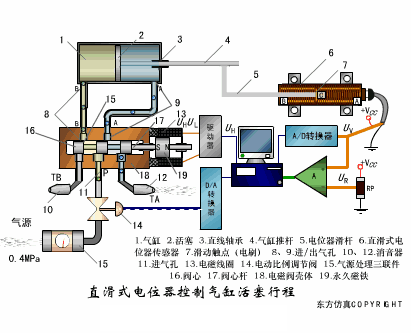

压阻式传感器测量液位的工作原理       
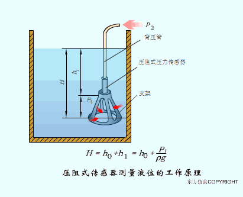

MQN型气敏电阻结构及测量电路      
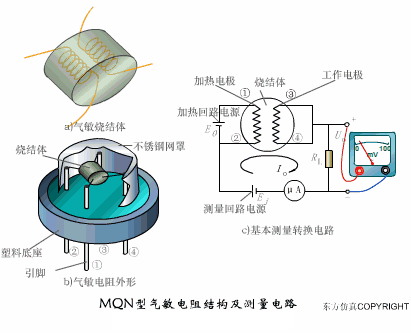

气泡式水平仪的工作原理       
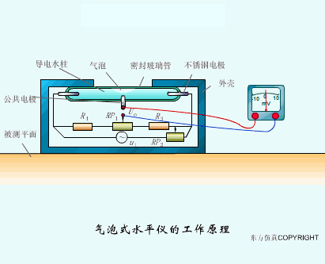

扩散硅式压力传感器       
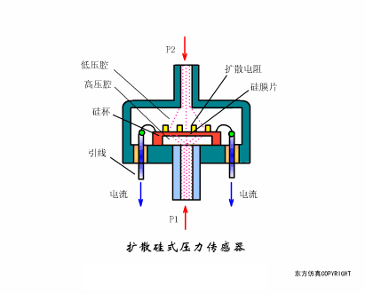

应变加速度感应器        
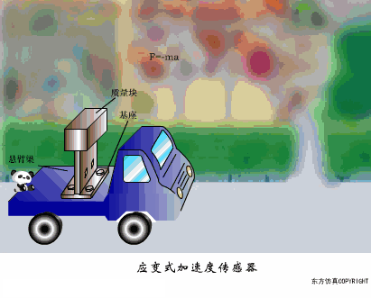

称重式料位计           
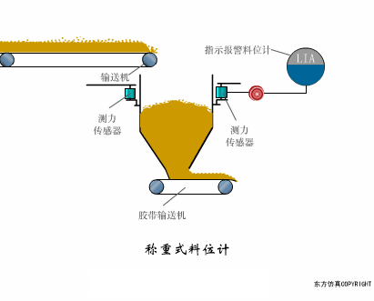

电子皮带秤重示意图            
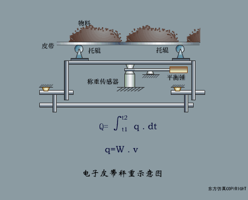

电子吊车秤            
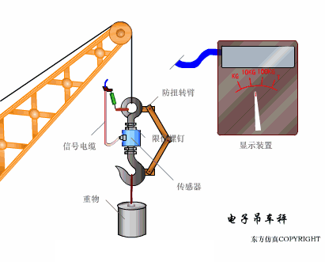

荷重传感器用于测量汽车衡的原理           
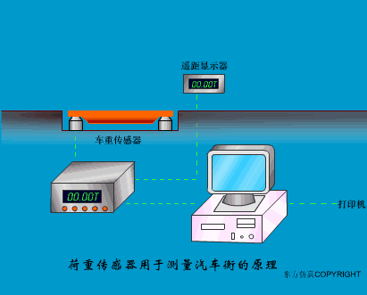

荷重传感器的应用          
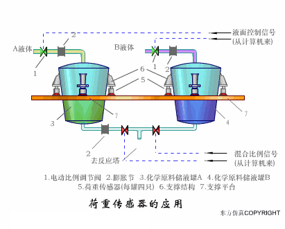

TiO2氧浓度传感器结构及测量电路          
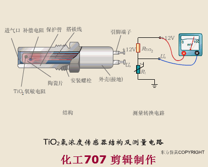

电位器式传感器              
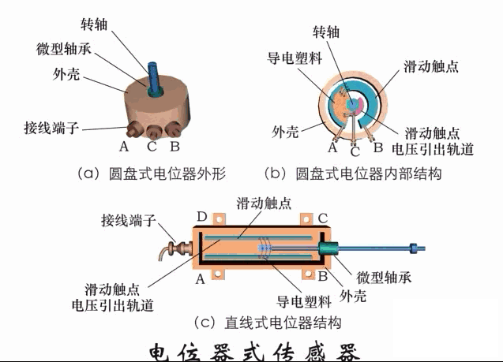

陶瓷湿度传感器              
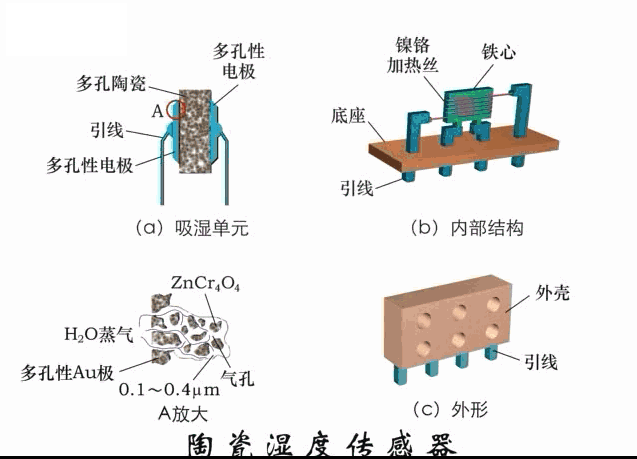

多孔性氧化铝湿敏电容原理             
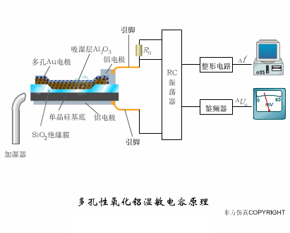

基本变间隙型电容传感器和
差动变间隙型电容传感器的工作原理
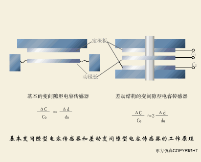

变面积型电容传感器工作原理           
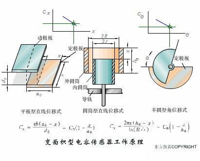

利用接近开关进行物体位检测的原理
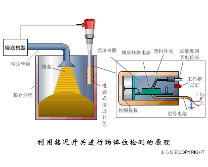

光柱显示编码式液位计原理          
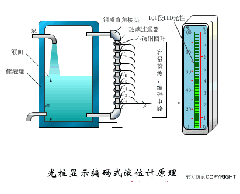

电容式压力传感器            
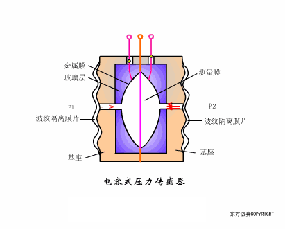

差压式液位计a            

差压式液位计b            
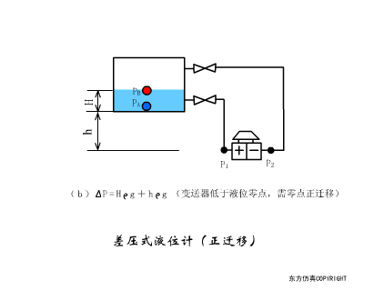

差压式液位计c            
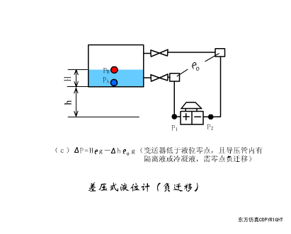

电容液位计原理图            

电容测厚仪             
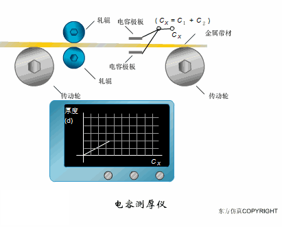

电容加速度传感器                 
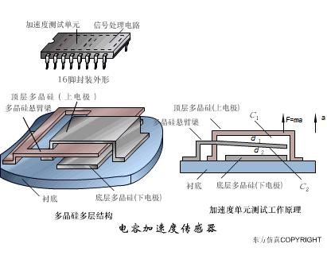

电容式油量表原理          
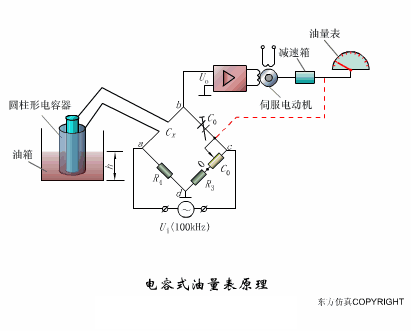

频率差法测量流量的原理             
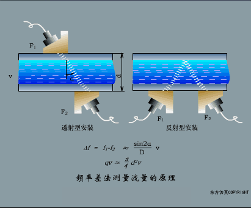

空气传导型超声波发生、接收器的结构               
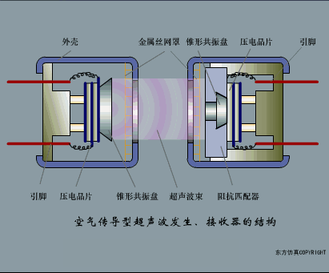

超声波应用的两种类型                   

超声波探头的结构               
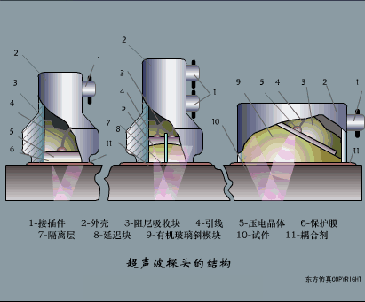

超声波流量计的原理              
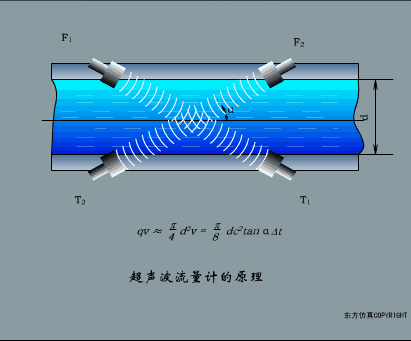

超声波测厚的原理
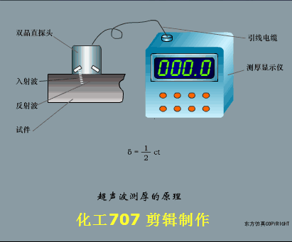

超声波测量密度原理              
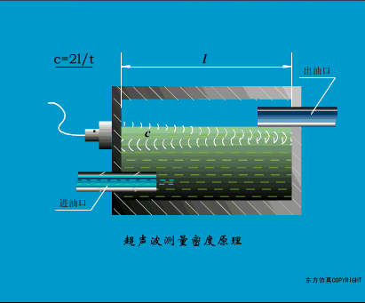

超声波测量液位原理             
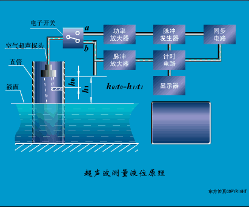

超声防盗报警器                 
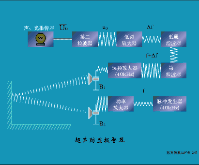
 
纵波探伤         
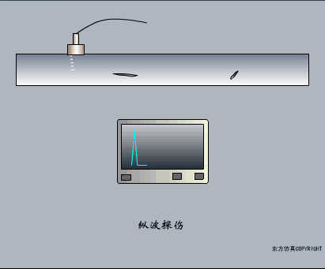

横波探伤
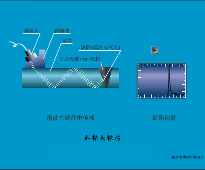

表面波探伤
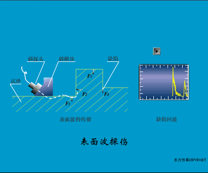
 

