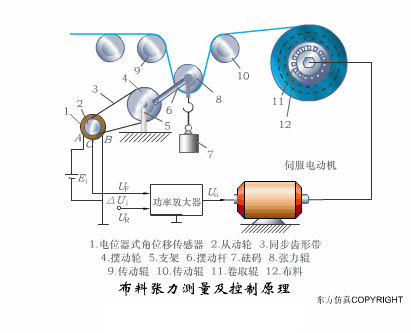
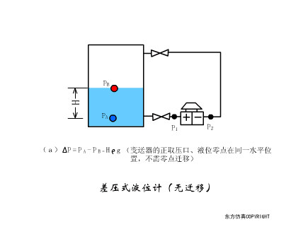
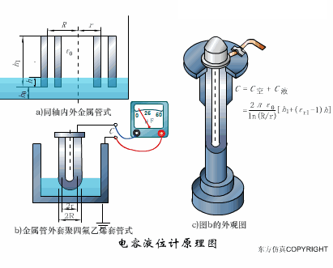
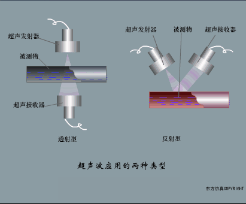

# 传感器工作原理动图汇总

布料张力测量及控制原理       

直滑式电位器控制气缸活塞行程       

压阻式传感器测量液位的工作原理       

MQN型气敏电阻结构及测量电路      

气泡式水平仪的工作原理       

扩散硅式压力传感器       

应变加速度感应器        

称重式料位计           

电子皮带秤重示意图            

电子吊车秤            

荷重传感器用于测量汽车衡的原理           

荷重传感器的应用          

TiO2氧浓度传感器结构及测量电路          

电位器式传感器              

陶瓷湿度传感器              

多孔性氧化铝湿敏电容原理             

基本变间隙型电容传感器和
差动变间隙型电容传感器的工作原理

变面积型电容传感器工作原理           

利用接近开关进行物体位检测的原理

光柱显示编码式液位计原理          

电容式压力传感器            

差压式液位计a            

差压式液位计b            

差压式液位计c            

电容液位计原理图            

电容测厚仪             

电容加速度传感器                 

电容式油量表原理          

频率差法测量流量的原理             

空气传导型超声波发生、接收器的结构               

超声波应用的两种类型                   

超声波探头的结构               

超声波流量计的原理              

超声波测厚的原理

超声波测量密度原理              

超声波测量液位原理             

超声防盗报警器                 

 
纵波探伤         

横波探伤

表面波探伤

 

