# 污水变净水

这种净水器可以把污水、茶水、可乐等液体过滤成净水，适合处理简单的污染水源。

## 所需材料：

塑料矿泉水瓶、刀、纱布、小石子（小卵石）、石英沙、活性炭、膨松棉、酒瓶软木塞、吸管

## 制作过程：
　　

找一个干净的塑料矿泉水瓶
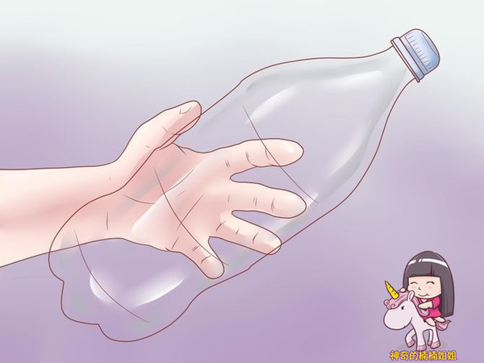

用刀切掉底部
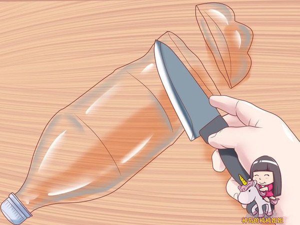

在瓶口上戳一个洞。如果你能找到酒瓶软木塞和吸管，可以不要瓶盖，把瓶口处塞入一个木塞和吸管
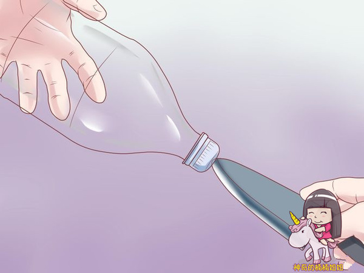

把膨松棉、纱布、小石子（鹅卵石）、活性炭、沙子、石英沙分层放入矿泉水瓶中

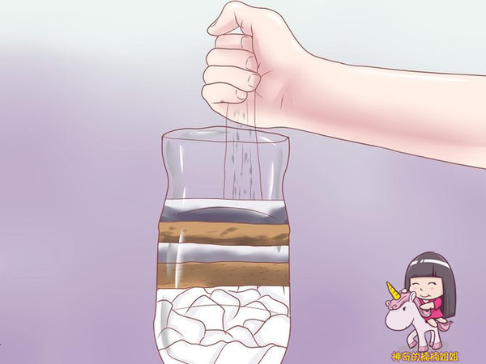

在瓶子的上方再加一块纱布，一个简易过滤器就做好了！
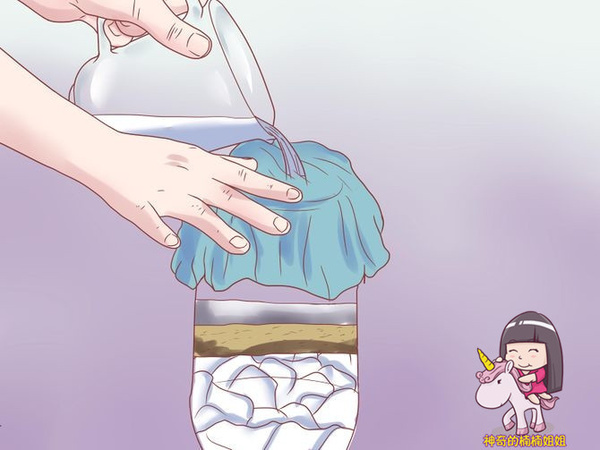

把污水倒入自制的净水器，经过层层过滤和净化，干净的水出现啦！
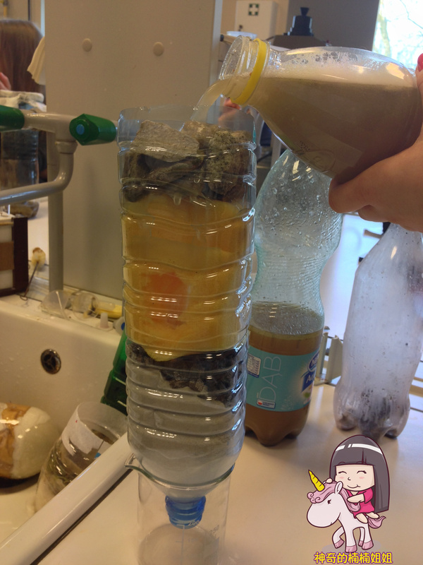

让我们看看结构图吧
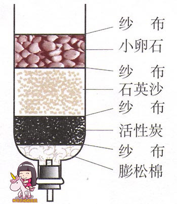

如果你在家里找不到这么多这么全的材料，那你可以试试少用一两种材料，做出不同层次的净水器，但是过滤效果可能就要差一些了。

让孩子们大胆的试验下，如果我们打乱排列顺序，或者减少、重复增加过滤材料，会带来什么样的变化呢？

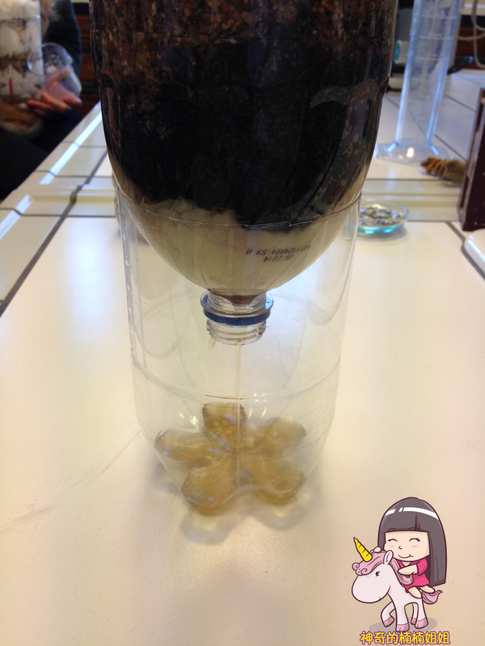

如果过滤层太少了的话，过滤不成功。
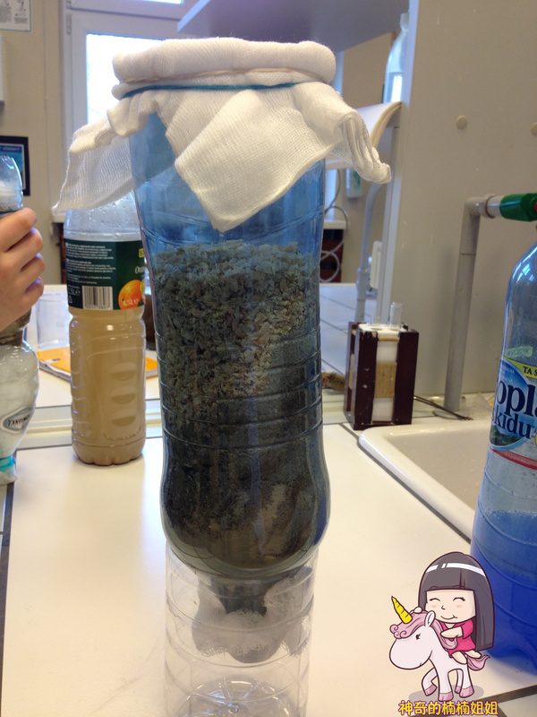

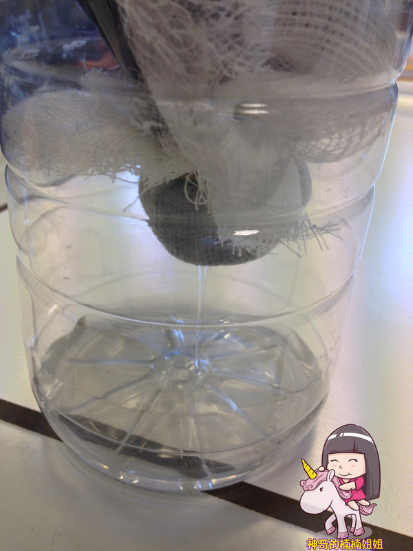

在瓶子的上下两端再套一层厚厚的纱布也是个好方法哦。

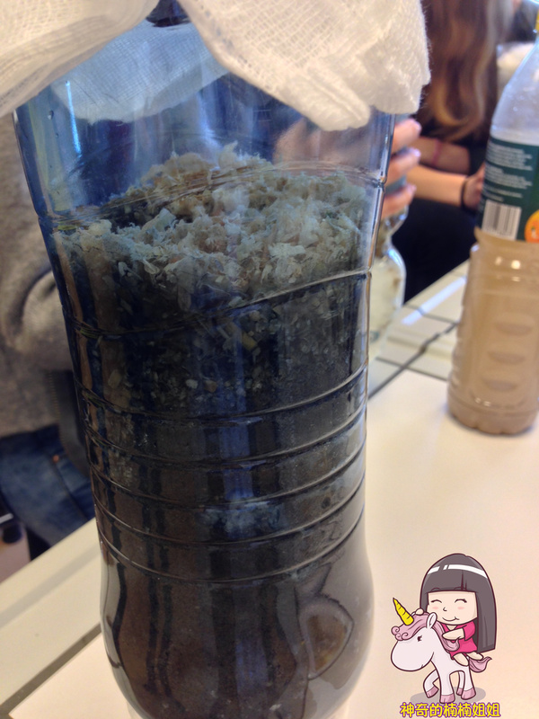

看这个净水器，加入了木屑做过滤层

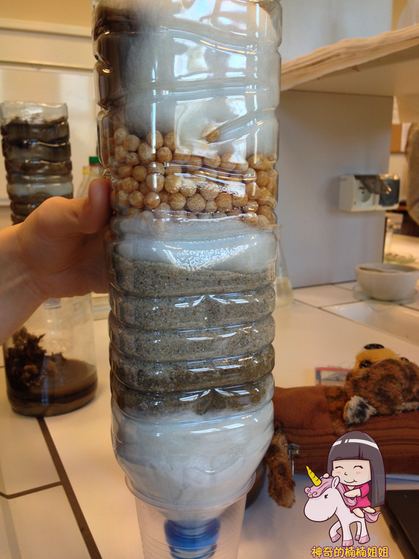

如果没有小石子或小卵石，用豆子、玉米等粮食替代也是可以的哦！