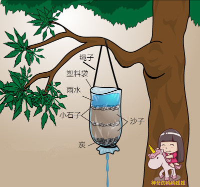
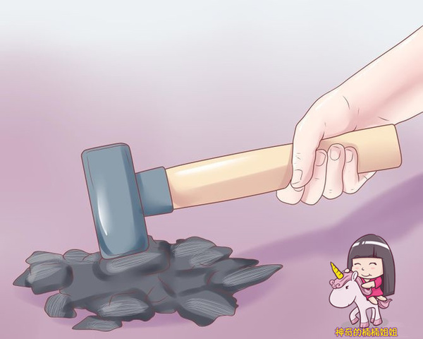

如果在野外宿营、或者荒野求生时没有干净水源。

那该这么办呢？我们可以收集雨水，但是雨水是不可以直接饮用的，那么我们可以做一个雨水收集过滤器。
	
	
所需材料：绳子、塑料袋、小石子、沙子、碳
　　

制作过程：做法与第一种净水器相似 ，也是用多种材料分层叠加的方式过滤污水。

只不过我们用塑料袋代替了矿泉水瓶，再把塑料袋挂到树上收集雨水。

用这种方法可以制作出好多个过滤器，挂在很多地方。

既能收集水源，也能直接过滤。
　　
　　

如果你有疑问：难道我到荒野的时候会随身携带活性炭吗？当然不会。

我们可以使用露营时点起篝火所使用的木头烧成的碳，把它们砸碎就可以了。

刚过滤出来的水会带有黑色碳粉，过一会就变干净啦！

