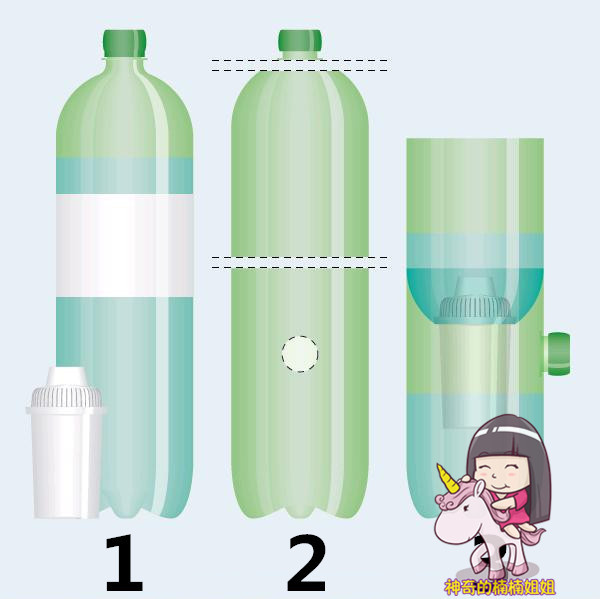
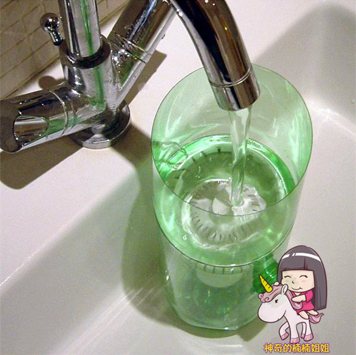
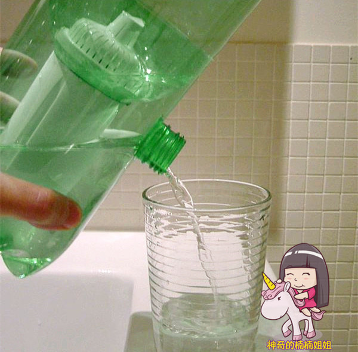
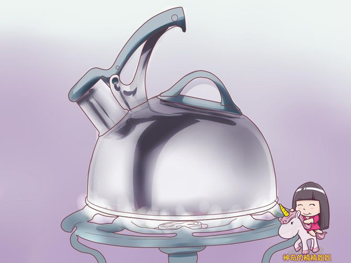

我们都知道：有的人住在高层，自来水压达不到一定的高度，在高层住宅中，自来水需要二次加压，增加了污染。

如果存水处不及时清理，或者水管老化，水中会有很多的杂质。

如何花少量的钱，得到干净的水呢？让刷碗的水，洗漱的水变得更干净。

不妨试试这种净水器。

让娃给妈妈做一个爱心净水器吧！

准备材料：大矿泉水瓶、剪刀、净水芯（购买）

制作过程：

1. 根据图片所示，需要一个大饮料瓶和一个购买到的净水芯。净水芯里面放置的过滤层与我们之前两种过滤器相似。但是需要用一段时间后就更换新的。

2. 如图所示，用剪刀把瓶子剪开，在瓶身上掏个洞。洞的直径与瓶口一致。

3. 如图所示，把净水芯与瓶子的各个部位组合起来。OK完成了！就这么简单吗？是的！
　　
　　

怎么样？这样的水喝起来会安心多了吧？

最后提示，要饮用的水还是要烧开了才最安全哦。

很多细菌会在沸腾时被杀死。