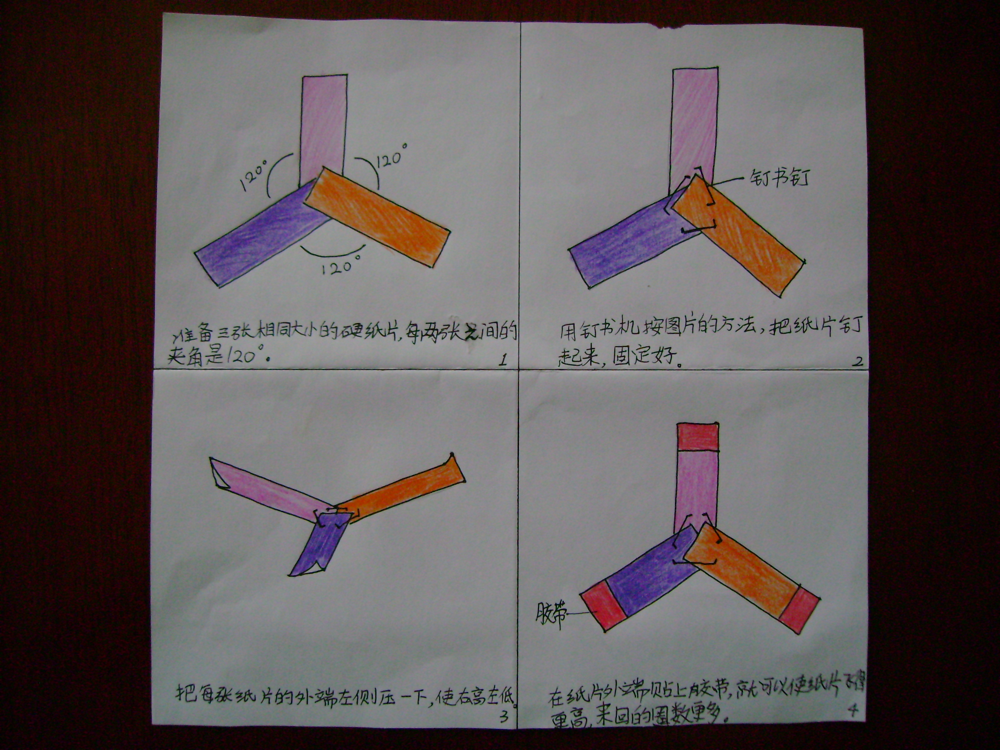

# 飞去来器

只需要三张小纸片就做成了“飞去来器”。

准备三张稍硬的长方形小纸片，纸片的一端叠起来，每两张纸片间夹角120。

用钉书钉把纸片钉起来，然后把每张纸片外端的左侧压一压，让纸片外端*右高左低。*

用大拇指和食指夹住纸片仰起腰，把腰挺起来的同时将纸片甩出去。

出处：<http://www.ccppg.com.cn/e/DoPrint/?classid=1074&id=129877>
