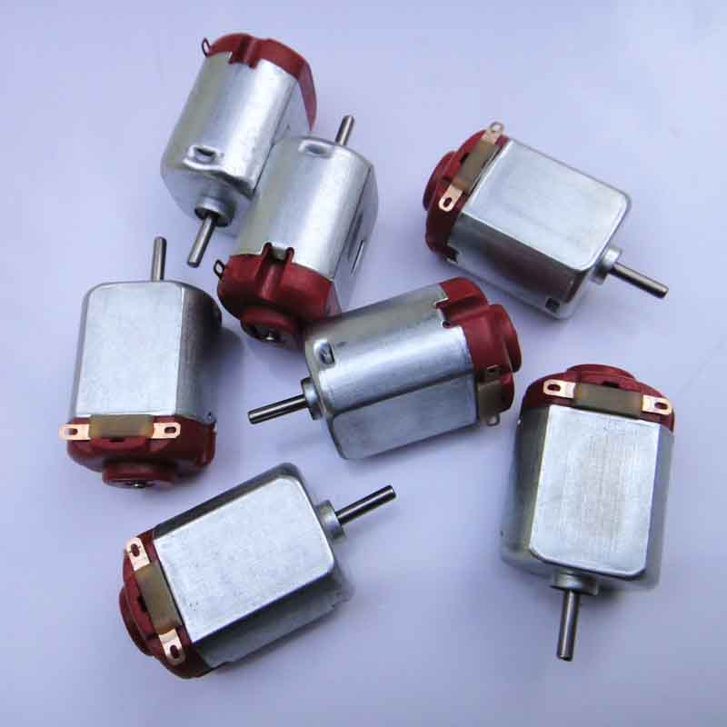
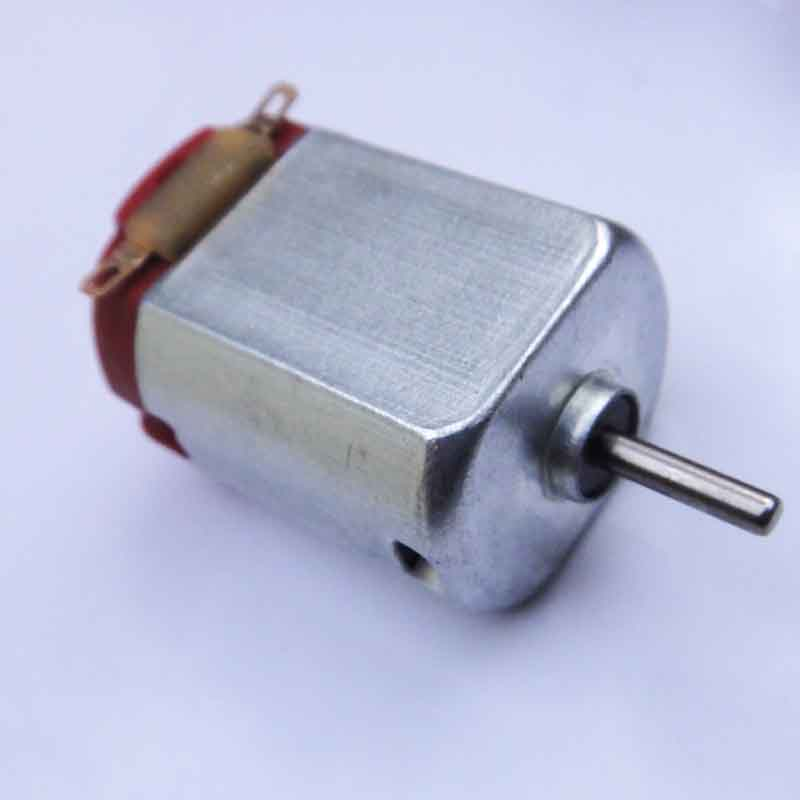
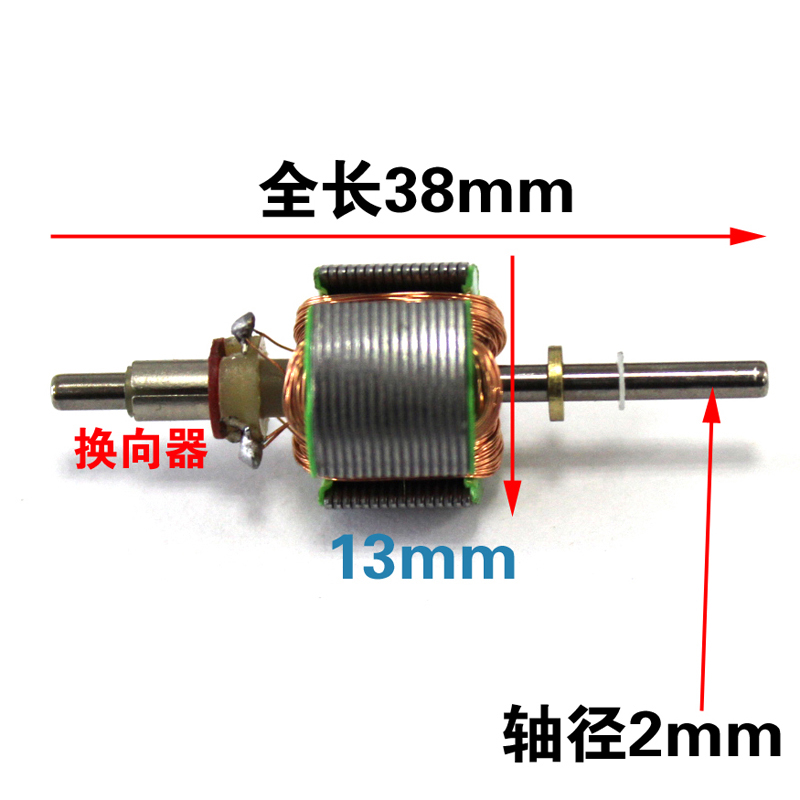
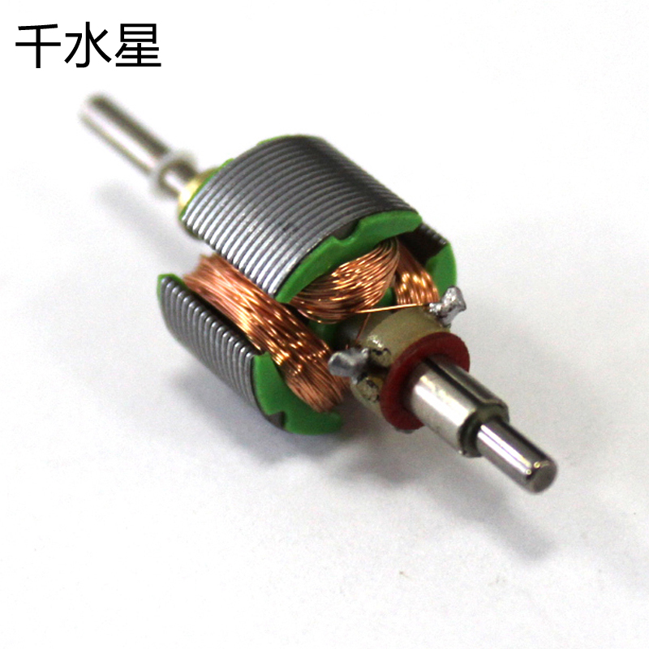
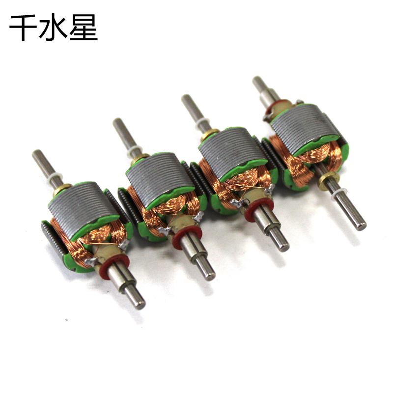

# 130 电机 玩具马达

130微型电机直流马达，内部绕组是全铜线

【长度】：25mm  
【高度】：15mm   
【宽度】：20mm   
【轴径】：2mm    
【轴长】：7.5mm   
【电压】：3V
【转速】：3V时候每分钟约16500转     
【电流】：3V时候，空载电流约350ma，堵转电流约1.3A    
【重量】：约15g（1个）

<https://detail.tmall.com/item.htm?spm=a1z10.5-b.w4011-15847271617.70.YPa60f&id=37655670483&rn=8beeb1487ee9facd57be59be930c221c&abbucket=18>

130电机，在模型比赛中是最常用的一种微型直流电动机，广泛应用在微型车辆模型和微型的船模中。它的优点是价格便宜。

缺点

* 由于各商家为追求利益的最大化，还偷工减料，致使性能进一步降低。
* 转速上不去，
* 电刷容易坏

是决定了它在使用一两次后，很容易被抛弃。

## 130电机转子
<https://detail.tmall.com/item.htm?spm=a220o.1000855.0.0.fUnJIx&id=542787381049>

