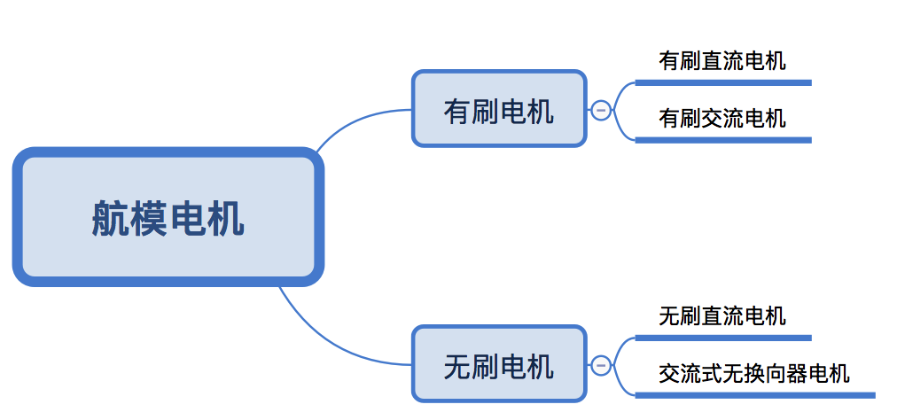
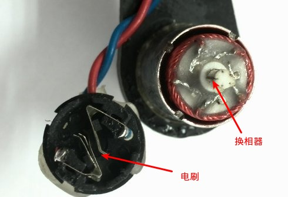
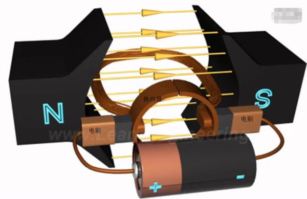
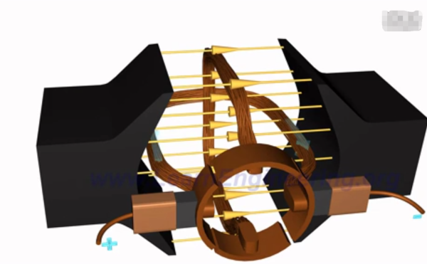
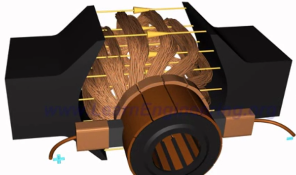
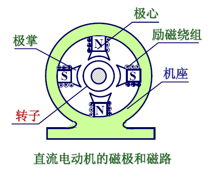
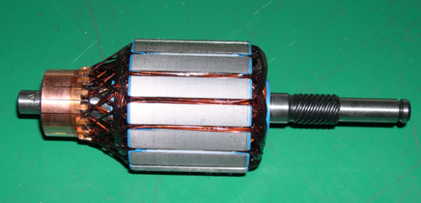

# 电机分类

有刷无刷的分类 跟 交流直流的分类是两套分类，他们互相有交集。

## 有刷电机

有刷电动机是内部含有换相电刷的电动机。

电刷通过绝缘座固定在电动机后盖上，将电源的正负极引入到转子的换相器上，而换相器连通了转子上的线圈，线圈极性不断的交替变换与外壳上固定的磁铁形成作用力而转动起来。

下图是将使用的电机拆解之后看到的电刷和换相器。

直流电动机最简单的物理模型。

1. 直流电源电流顺着电源正极流到了左边的电刷上面，电刷和换向器相互摩擦，电流经过左边的换向器（也叫换向片，这个电机有左右两个换向片）流进线圈，从线圈的右边流出来，经过右边的换向片和右边的电刷流回到电源的负极，形成了闭合回路。

2. 由于线圈处在主磁极（图中的N和S）的磁场中，线圈会受到电磁力的作用，线圈的两个边由于电流的方向不同（左边的电流向里流，右边的向外流），所以两个线圈边受到大小相同方向相反的电磁力，这两个电磁力刚好形成了电磁转矩，在电磁转矩的拉动下，线圈开始转动了。直流电机中线圈嵌放在转子槽中，电动机就开始转动了。

3. 左右换向片跟着转轴转动，而电刷固定不动，转动一圈以后，右边的线圈到了左边，左边的线圈到了右边，但是由于换向片的存在，现在处在左边的线圈内的电流方向和原来处在左边的线圈变的电流的方向一样流向里，所以受到的电磁力方向不变，右边也一样。所以从空间上看，在相同位置的线圈边受的电磁力方向是一直不变的，这就保证了电机的循环转动。

4. 但是一个线圈，由于这个线圈转到不同位置时磁场是不相同的，导致了线圈所受的电磁力也一直在变，所以线圈转起来不稳定，忽快忽慢。所以可以通过多安装几个线圈来保证线圈受力均匀和稳定。

再说外面的两个磁极，其实是有励磁线圈产生的电磁铁，小电机中有永磁铁，稍微大一点的都会用电磁铁。

模型是模型，但真实的电机转子是这个样子的。

### 有刷电机的问题

* 摩擦大，损耗大 

	有些朋友在用有刷电机的时候常碰到这个问题，那就是使用电机一段时间以后，需要打开电机来清理电机的碳刷，费时费力，维护强度不亚于来一次家庭大扫除。

* 发热大，寿命短 　 

	由于有刷电机的结构原因，电刷和换向器的接触电阻很大，造成电机整体电阻较大，容易发热，而永磁体是热敏元件，如果温度太高的话，磁钢是会退磁的，使电机性能下降，影响有刷电机的寿命。 

* 效率低，输出功率小 

	上面说到的有刷电机发热问题，很大程度是因为电流做功在电机内部电阻上了，所以电能有很大程度转化为了热能，所以有刷电机的输出功率不大，效率也不高。

## 无刷电机

### 无刷电机优点

* 无电刷、低干扰 　 

	无刷电机去除了电刷，最直接的变化就是没有了有刷电机运转时产生的电火花，这样就极大减少了电火花对遥控无线电设备的干扰。 
	
	
* 噪音低，运转顺畅 

	无刷电机没有了电刷，运转时摩擦力大大减小，运行顺畅，噪音会低许多，这个优点对于模型运行稳定性是一个巨大的支持。
	
	
* 寿命长，低维护成本 　 

	少了电刷，无刷电机的磨损主要是在轴承上了，从机械角度看，无刷电机几乎是一种免维护的电动机了，必要的时候，只需做一些除尘维护即可。	