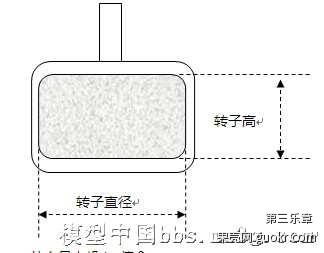

# 电机型号

经常看人说什么2212电机，2204电机等等，到底是什么意思呢？这其实电机的尺寸。

不管什么品牌的电机，具体都要对应4位这类数字，其中前面2位是电机转子的直径，后面2位是电机转子的高度。注意，不是外壳哦。

简单来说，前面2位越大，电机越肥，后面2位越大，电机越高。

例如常见的2212电机一般用来做450轴距的航拍机，

2204电机一般用来做210轴距的穿越机。

对于空心杯电机，命名也是用直径和高度两个数字，但是一般指外壳的尺寸。

如720电机，615电机等。

