# 硬纸板盔甲

出处：
<http://www.rouding.com/chuantongshougong/zhidiaozhezhi/30842.html>

效果图：

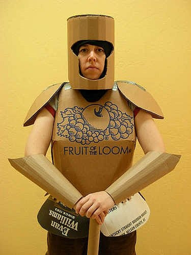

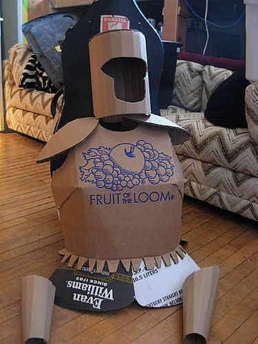

完全用纸板打造的盔甲，打起仗来必须用软纸做兵器才行吧！

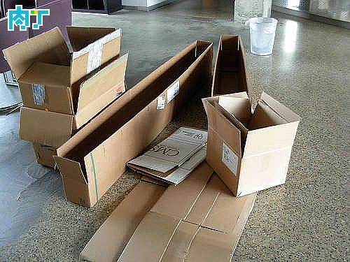

## 制作步骤

## 板甲

首先制作盔甲的躯干部分，纸板按照如图纸样剪裁，注意要大致量一下自己的身体尺寸哦，做出来的盔甲要可身材好

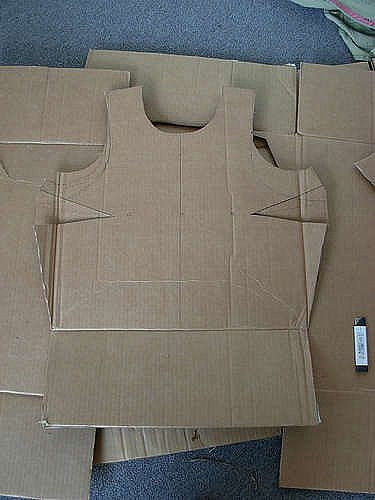

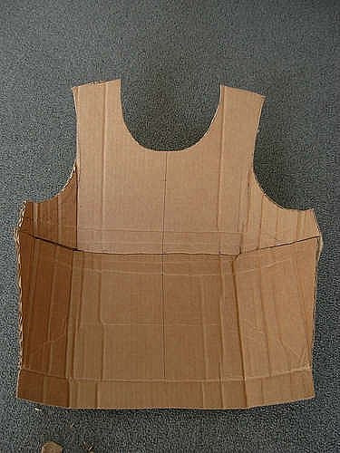

手工盔甲上衣基本制作成型了

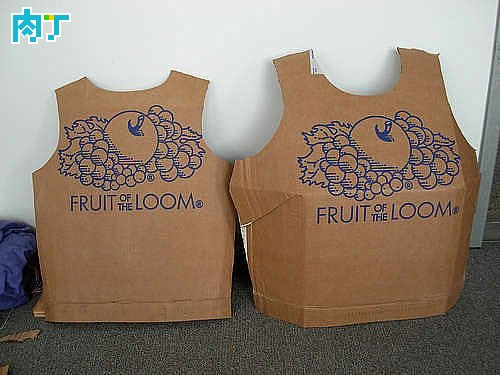

## 头盔

头盔部分的制作

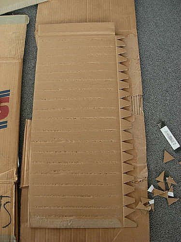

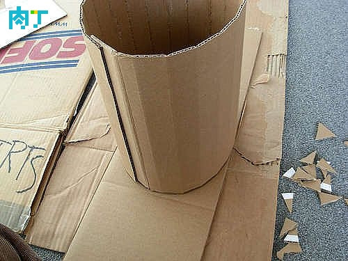

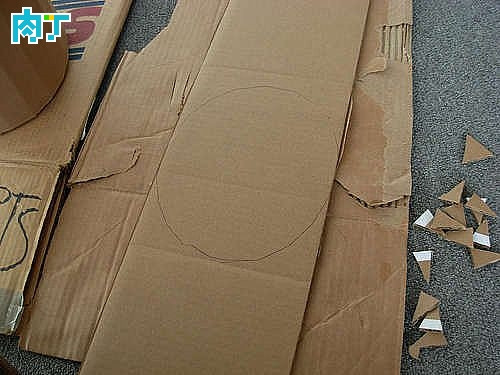

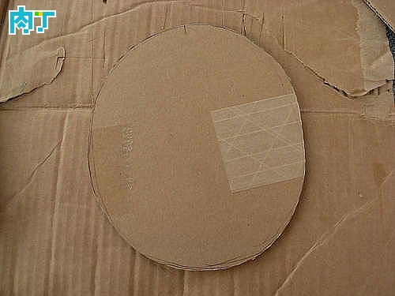

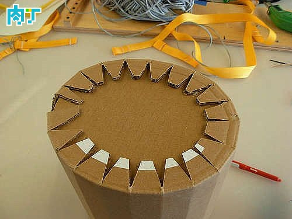

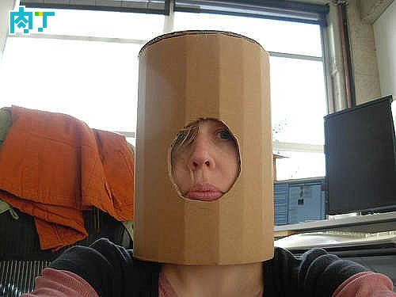

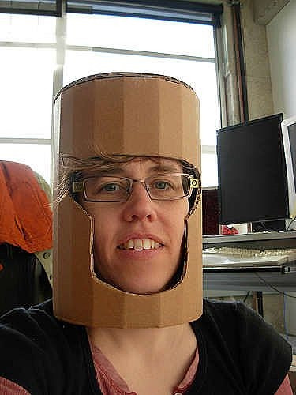

## 袖子部分

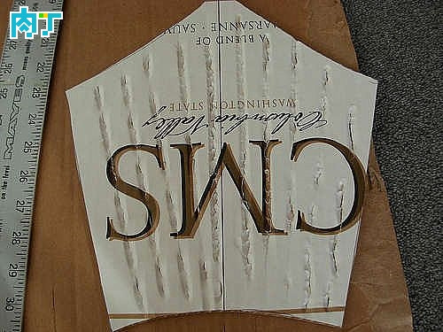

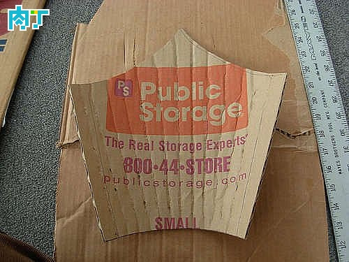

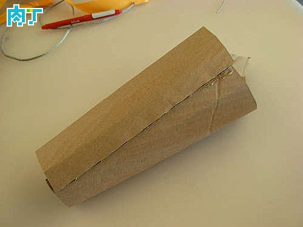

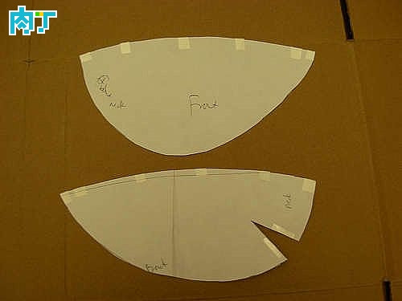

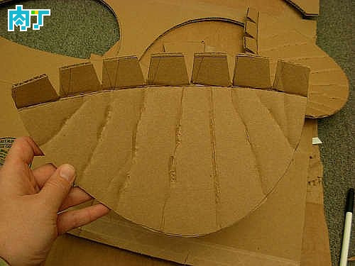

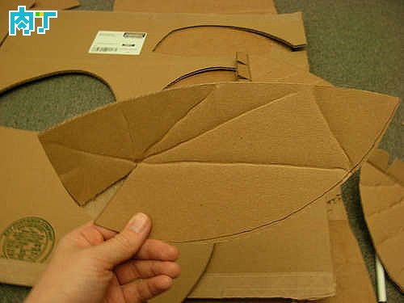

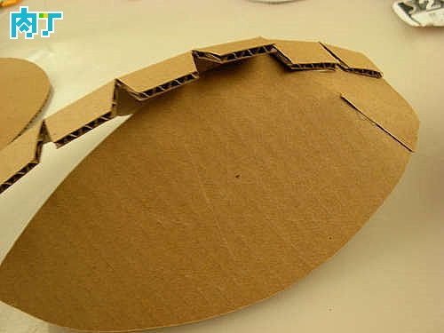

## 肩部

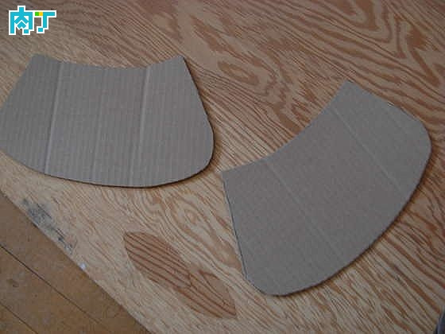

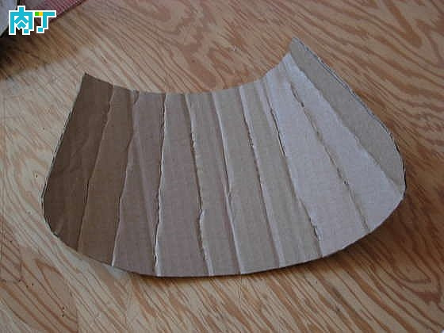

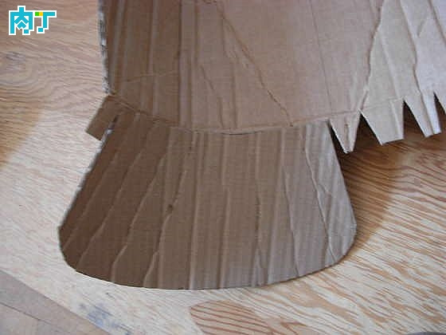

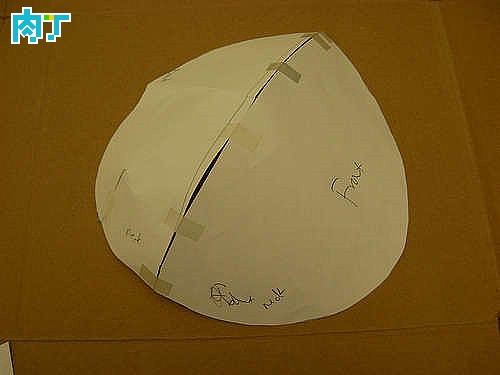

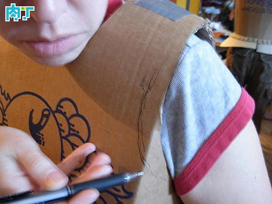

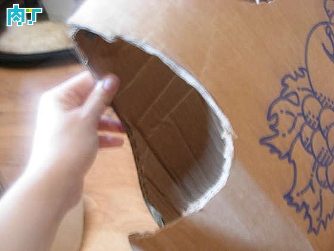

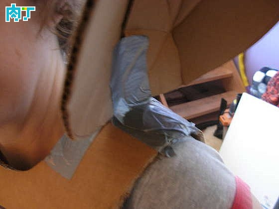

## 安装上身体各部份

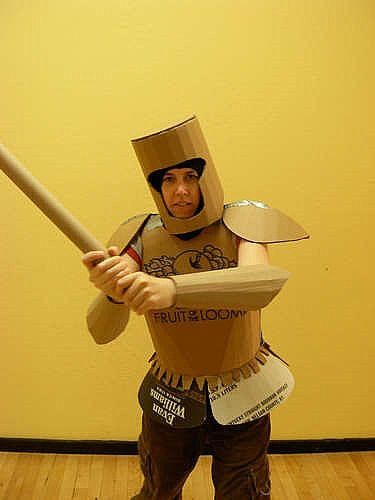

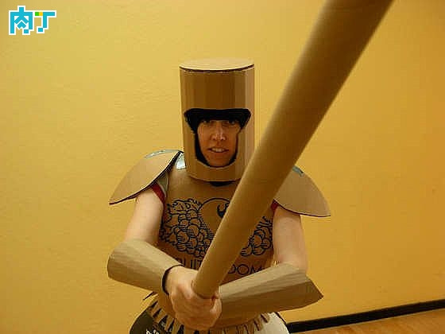
