# UHU胶水

UHU在粘性上很强，干的速度比502要慢，比乳胶要快 。

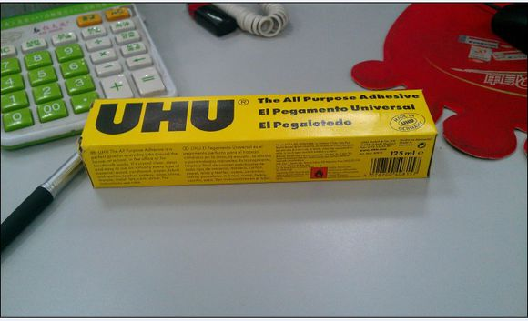

首先最重要的一点就是正确认识UHU的品牌！

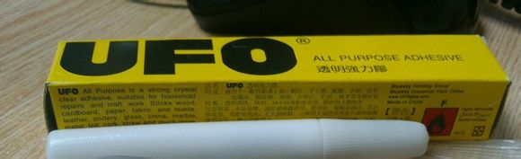
如果你和某骚年一样买到这种附带宇宙飞行功能的~那么恭喜你你中奖了~

125ml的UHU价格为18元（帝都价），相比晨光40ml的白乳胶3元（尾巴店）。各大建材、板材、化工商铺都应有售.

由于UHU的粘性很强，而且很容易拉丝，所以很多人不知道怎么用于纸模，接下来介绍方法。
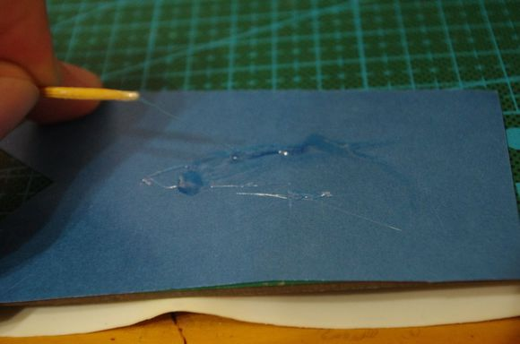

大多数人都应该使用的是这种针管法，由于针头很细，所以只要一点点挤出胶水就可以很容易的均匀涂抹，而且基本不会产生拉丝，但毕竟是针，而且通常针管较长，所以手小的妹子们使用可能有一定的安全隐患，使用这种方法请一定注意安全~

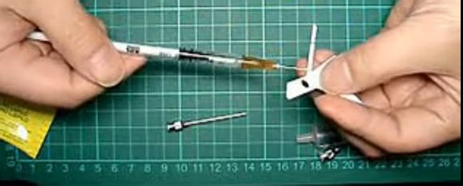

枪兵使用的是另一种稀释去拉丝的方法~先要准备一个可以密封的容器~

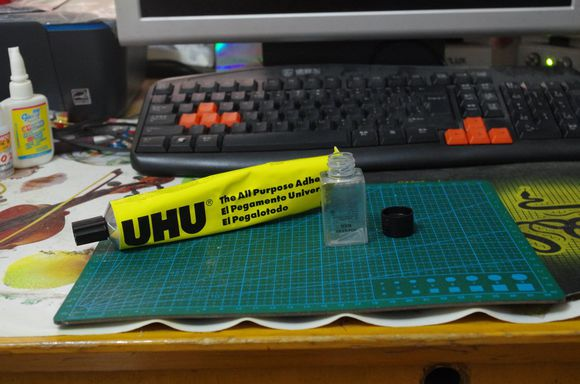

然后将UHU胶挤入一些~
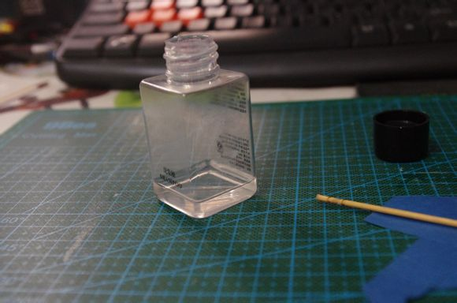

之后出场的就是我们主角了~95%酒精~~这种医用酒精各大药店均有销售，500ml的价格应在4.5~6元之间。
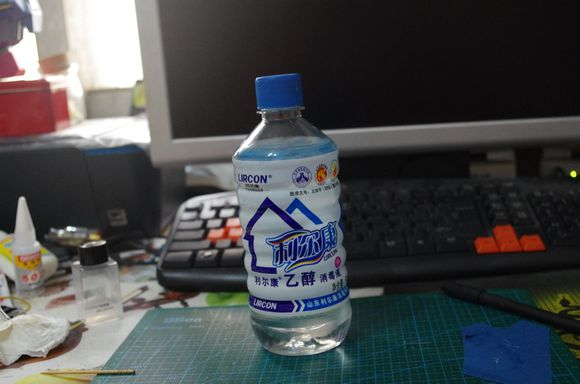

用蘸好胶的牙签均匀涂抹桥接，静致几秒（酒精在空气中有强挥发性，所以挥发后基本不会影响粘性）

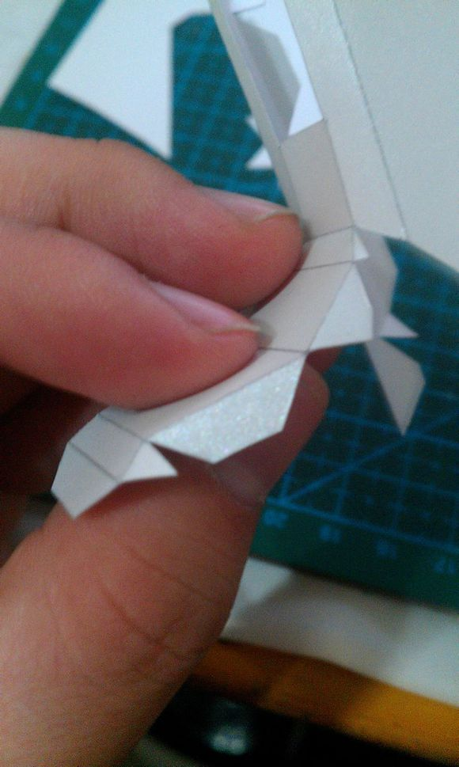
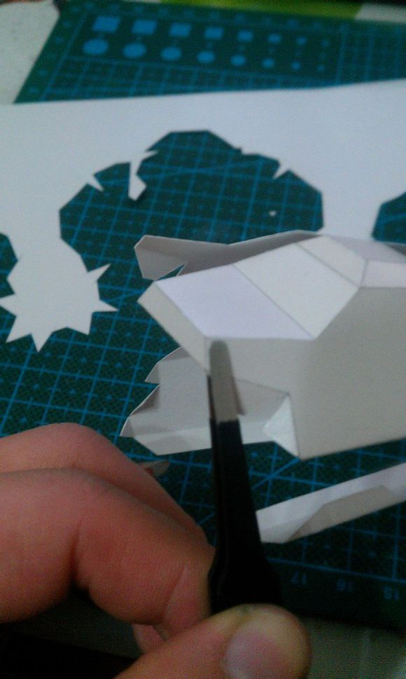
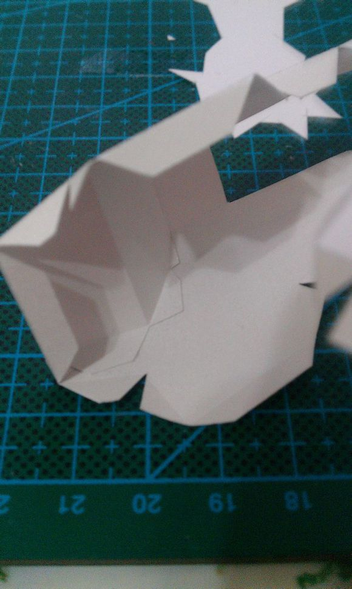

使用后要补充一些酒精，然后将容器密封，下次只要摇匀就可继续使用~

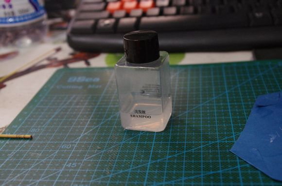

当然实际制作时还是要根据情况使用各种胶水，甚至是双面胶~总的来说我觉得UHU是做纸模最好使的了（个人观点，因人而异）。这次买的125ml的估计能用2年~

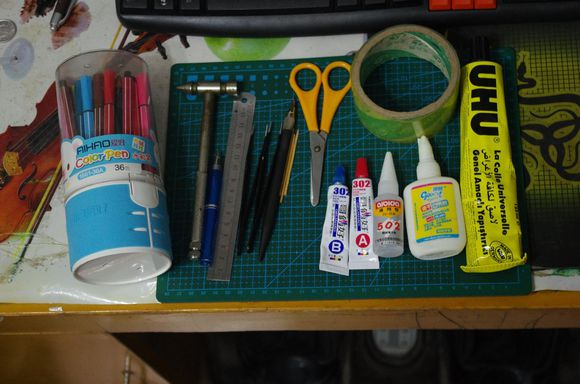

