船太小了，不好配置，建议重新做条65CM以上，电子设备也还配，也有升级的空间，别到时候搞电子设备的时候后悔了就麻烦了，我之前是弄50CM长的O，结果配到后来头痛，别提有多后悔了
<http://bbs.mx3g.com/thread-133244-1-20.html>

另外建议船体里里外外都刷漆，至少2到3层，起防水作用。船外部打原子灰后上自动喷漆！效果很好，船盖的话建议要做好点，不要太大，防水

所有无设备的空间最好用泡沫填充，就算进水了也不会丧失浮力。

打印图纸,5张A4纸
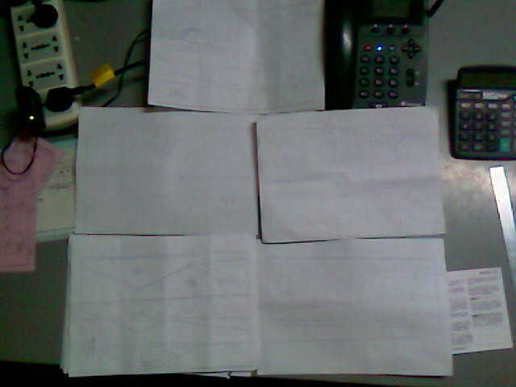

裁剪图纸.
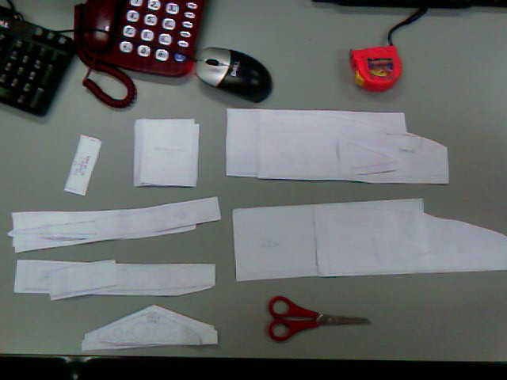

备料,好象是PVC材料,厚度2mm.
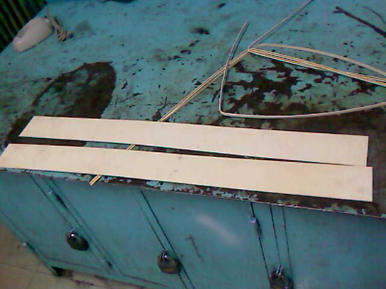

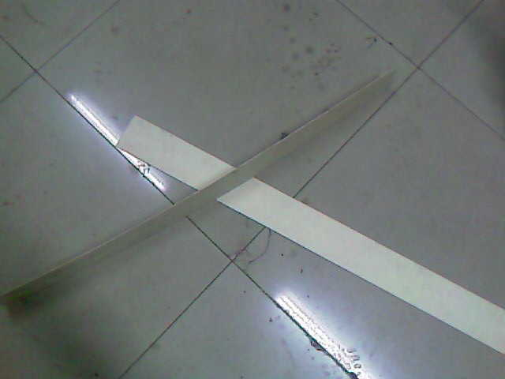

下料.

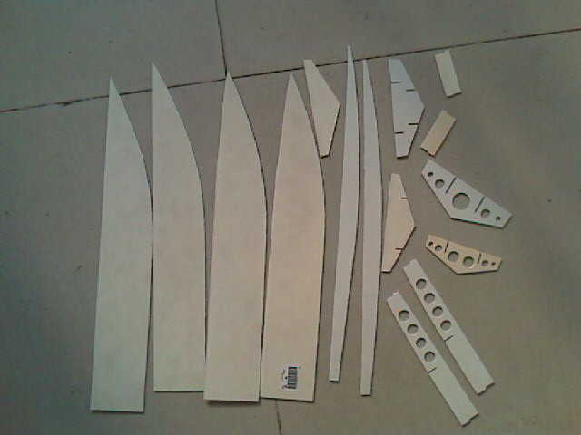

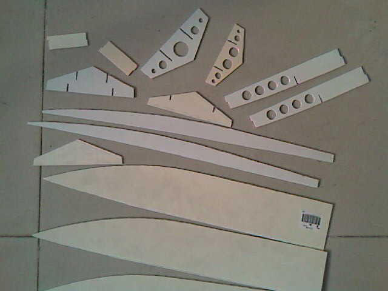

粘接龙骨.

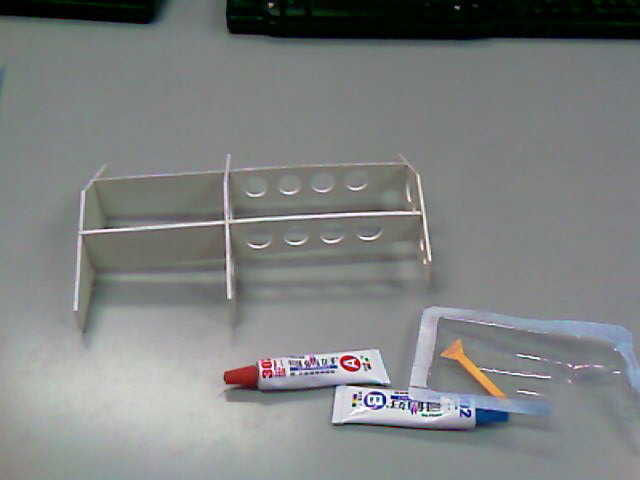

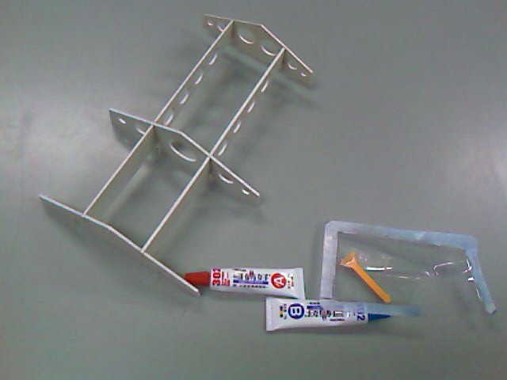

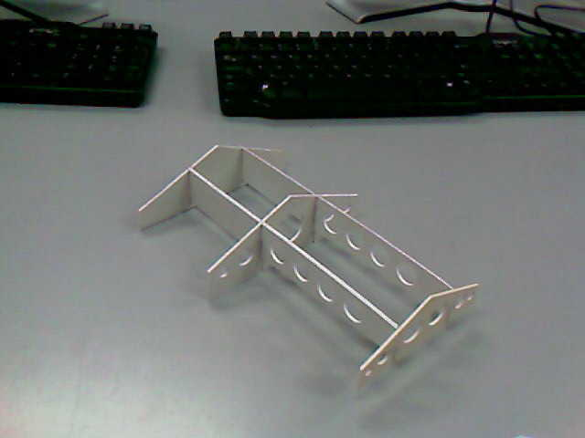

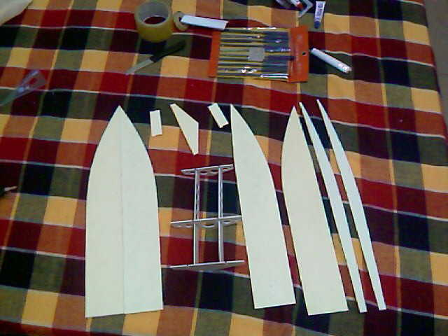

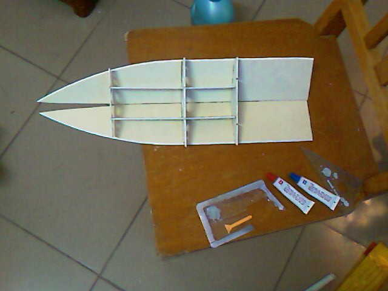
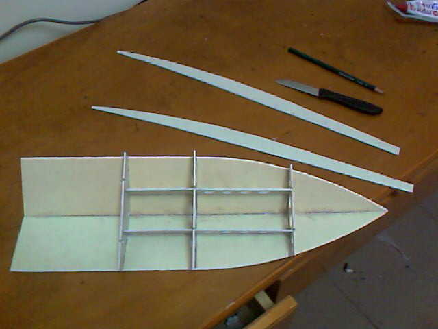
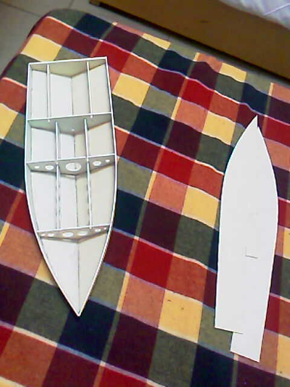
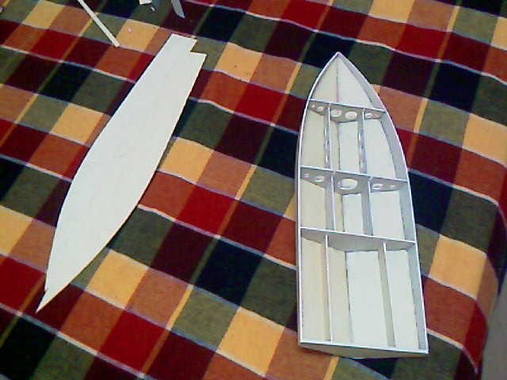
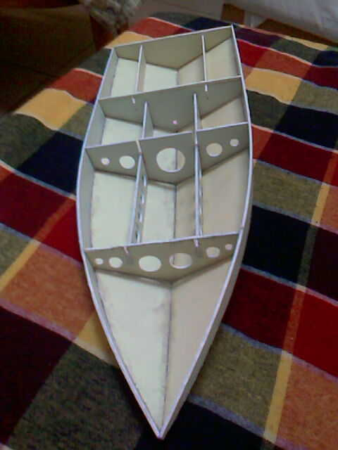
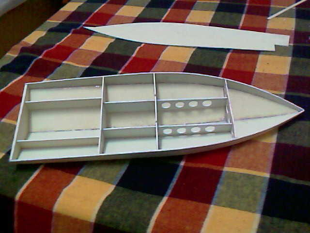
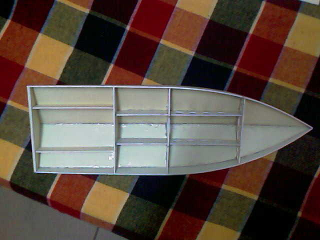
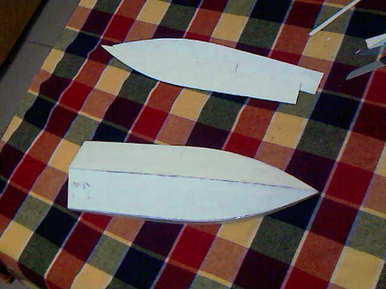
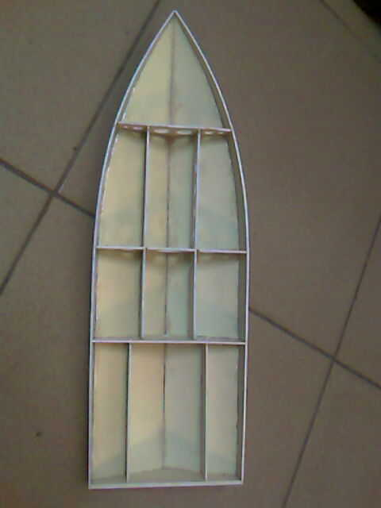

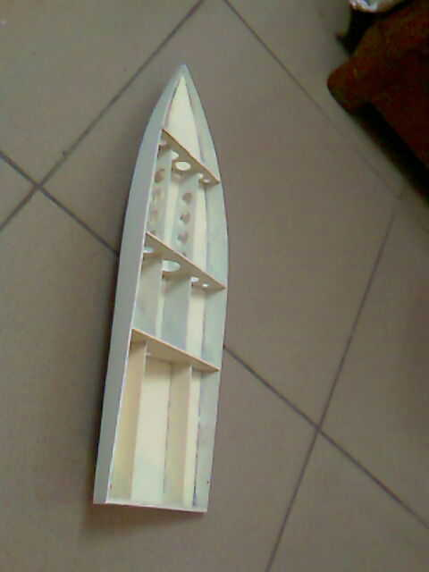
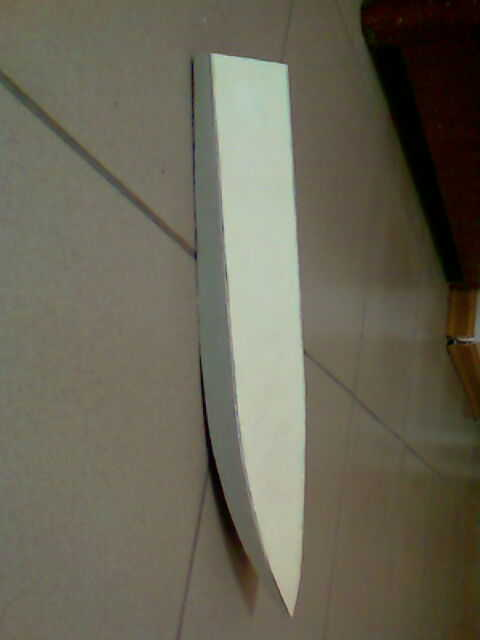
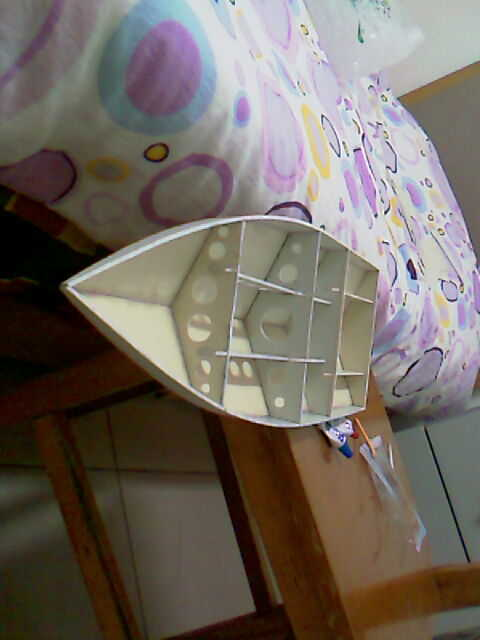
