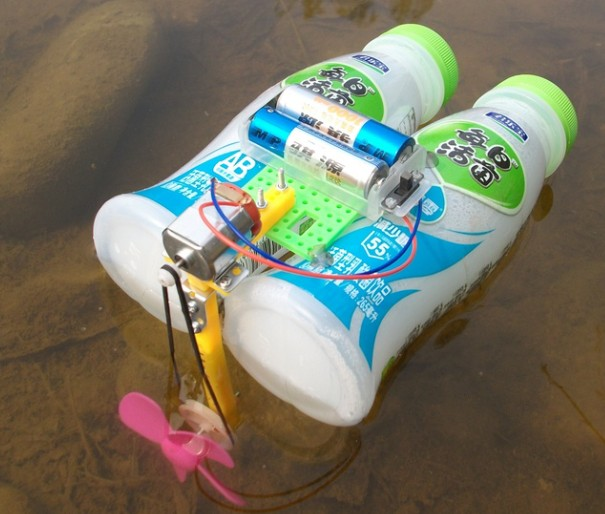
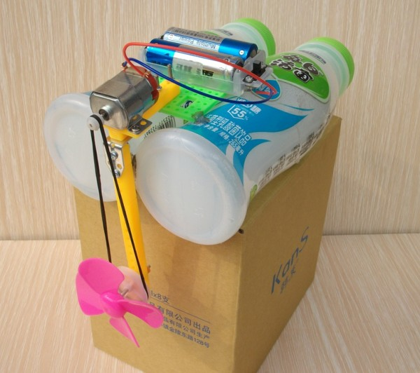

# 电动快艇

<https://item.taobao.com/item.htm?spm=2013.1.20141002.4.R9TS1K&scm=1007.10009.70205.100200300000001&id=39941750873&pvid=9cc197d3-7b68-45b9-b04f-e3d949eb270e>

螺旋桨完全入水，充分利用螺旋桨的旋转产生最大的推力

目录下可以看视频。

您觉得它还不够快，怎么办，加组电池盒吧。

无线遥控器（在本店配件分类里，您选两通道用的就可以了）可以前进可以后退。