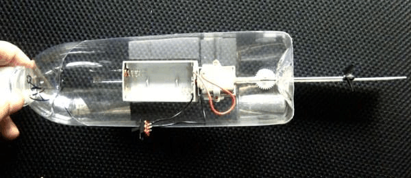

# 电动直线船的制作方法

## 材料：
可乐瓶，电池盒，马达，传动轴，螺旋桨，5号电池2节，泡沫胶，透明胶，剪刀，十字小螺丝刀

## 制作方法：

1、先在饮料瓶的中部剪开一个占瓶面积1/3左右的口子。

2、在瓶子里面安装电池盒，马达和传动轴

3、在瓶的底部打一个3mm组左右的孔。安装传动轴和马达。

4、在船的底部打一个孔，安装舵片。

5、下水调试，调整舵片，让船直线航行。

电动直线船的制作方法_文库下载

http://www.wenkuxiazai.com/doc/43bb1219b84ae45c3a358c26.html