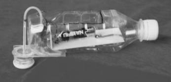
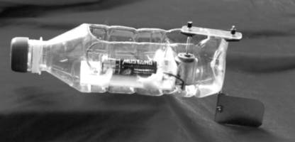
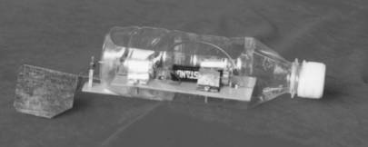
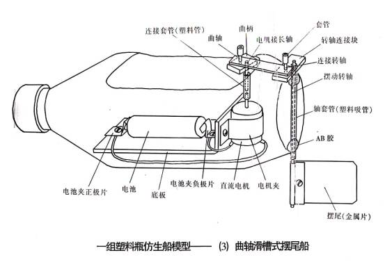

# 电动摆尾船

## 离心式喷水船

离心式喷水船是把我们学过和做过的离心式水泵，模拟墨斗鱼喷水动作研制出来的，巧妙地利用软轴传动(气门芯胶管)，把电动机轴的转动传递给水泵轴，使转动方向可达180°。

## 曲柄连杆式摆尾船

曲柄连杆式和曲轴滑槽式摆尾船是把机构学中转动变为振动和模仿鱼的摆尾动作而设计制作的。

## 曲轴滑槽式摆尾船

曲柄连杆式和曲轴滑槽式摆尾船是把机构学中转动变为振动和模仿鱼的摆尾动作而设计制作的。

