# 矿泉水瓶DIY空气动力船

原理：利用船尾螺旋桨的旋转，推动空气，产生推动船体的气流，同时产生作用于船尾的推力！

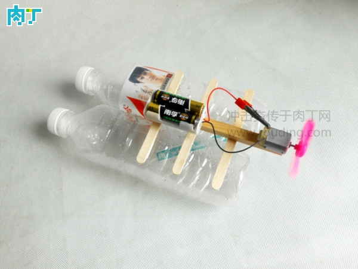

准备材料如图所示。

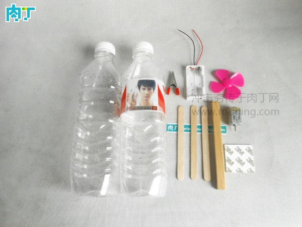

将雪糕棒和木方用白胶粘贴在一起。

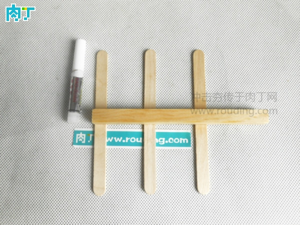

在电池盒和小马达的后面粘贴双面胶。

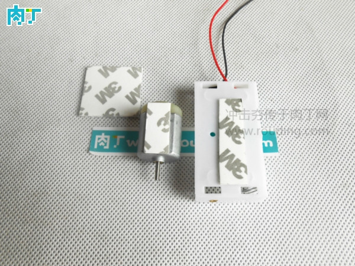

把它们粘贴在木方上面。

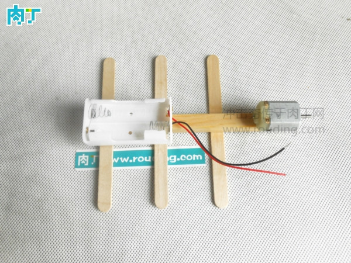

把螺旋桨安装在小马达上面。

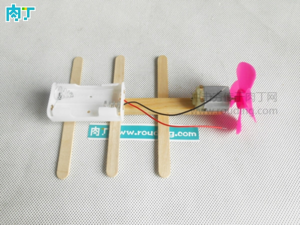

把电池盒的电线用鱼嘴夹与小马达相连接。

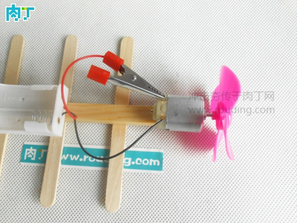

最后把雪糕棒粘贴在矿群水瓶上面就制作完成啦！

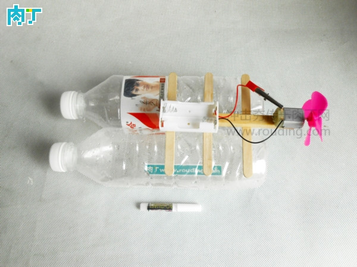

<https://item.taobao.com/item.htm?spm=a230r.1.14.31.EMQIat&id=532036710353&ns=1&abbucket=10#detail>
<https://item.taobao.com/item.htm?spm=a230r.1.14.135.EMQIat&id=534332616298&ns=1&abbucket=10#detail>
螺旋桨、电池盒、电机
长26cm，宽12cm，高11cm

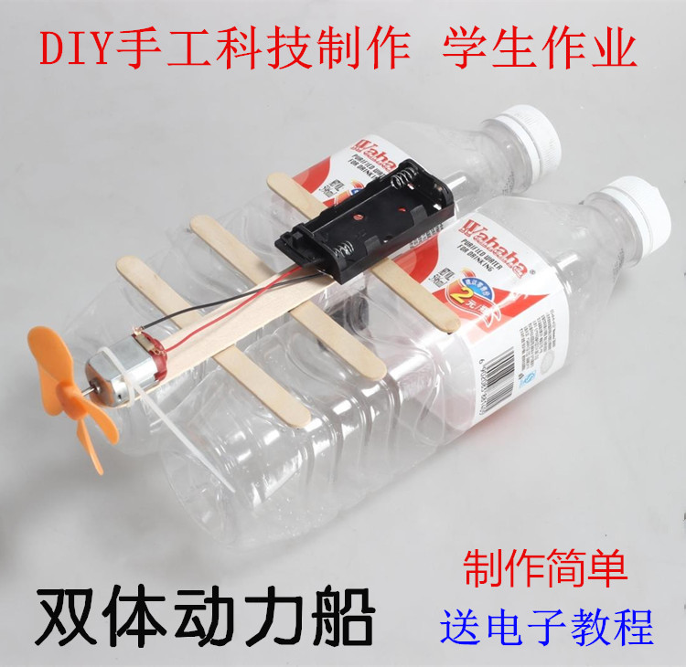
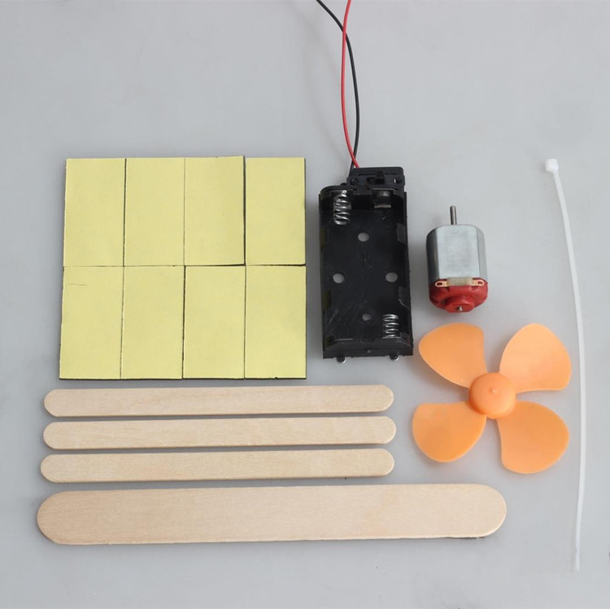
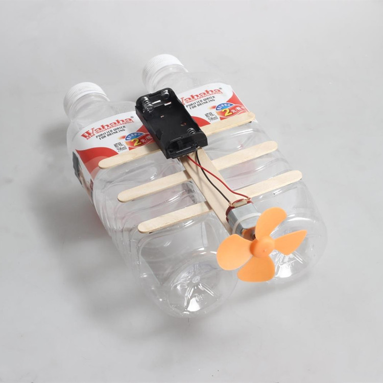
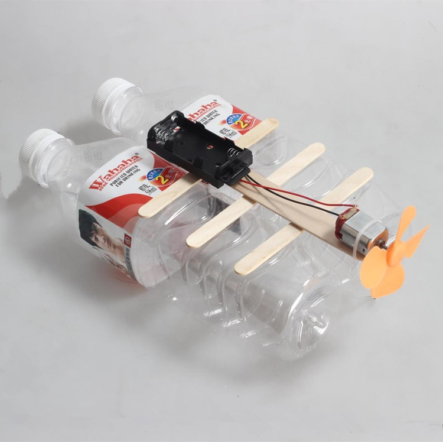
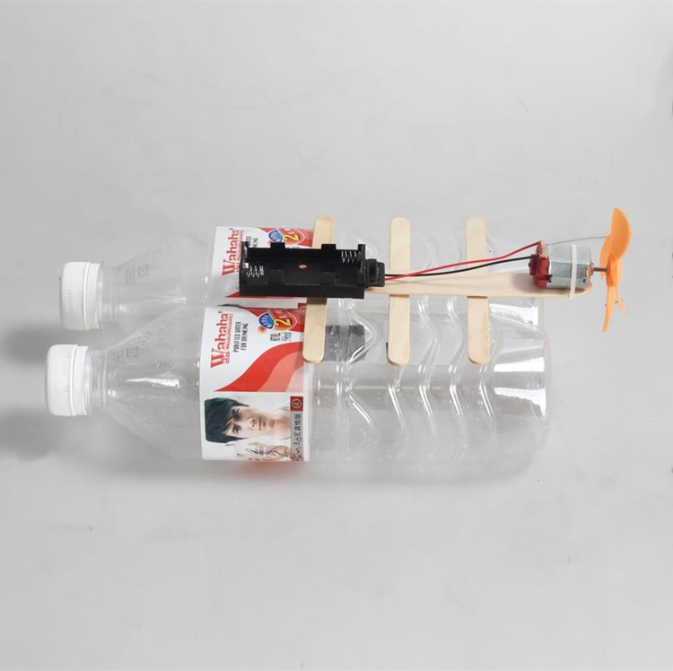

# 万用板空气动力船
<https://item.taobao.com/item.htm?spm=a230r.1.14.263.EMQIat&id=528919035196&ns=1&abbucket=10#detail>
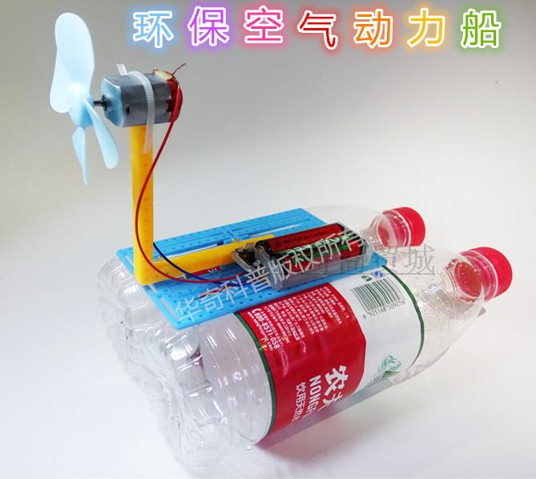
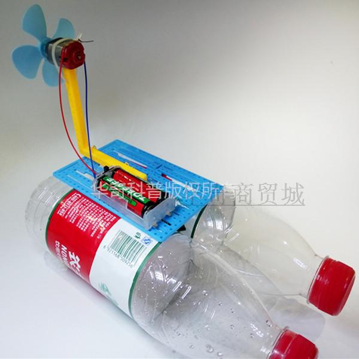
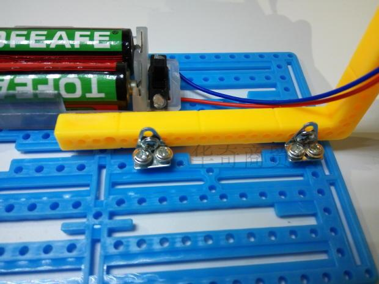

<https://item.taobao.com/item.htm?spm=a230r.1.14.16.EMQIat&id=42116948265&ns=1&abbucket=10#detail>

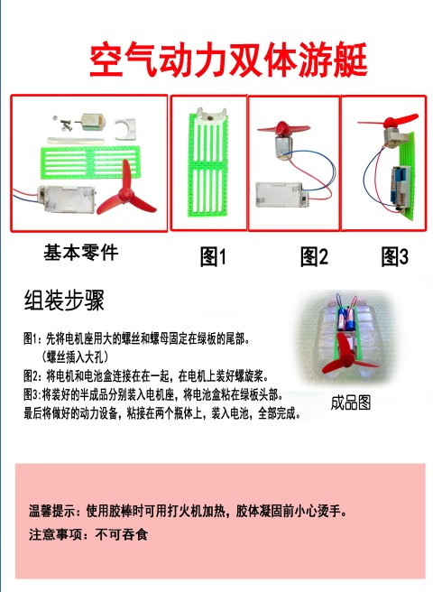

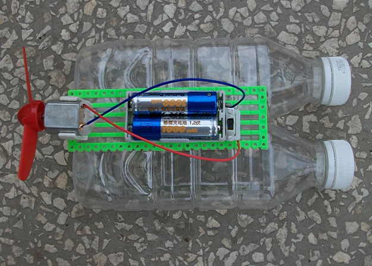

## 加旗子
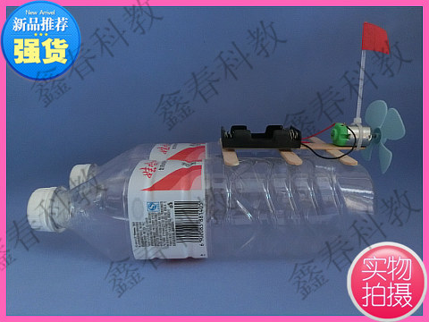

