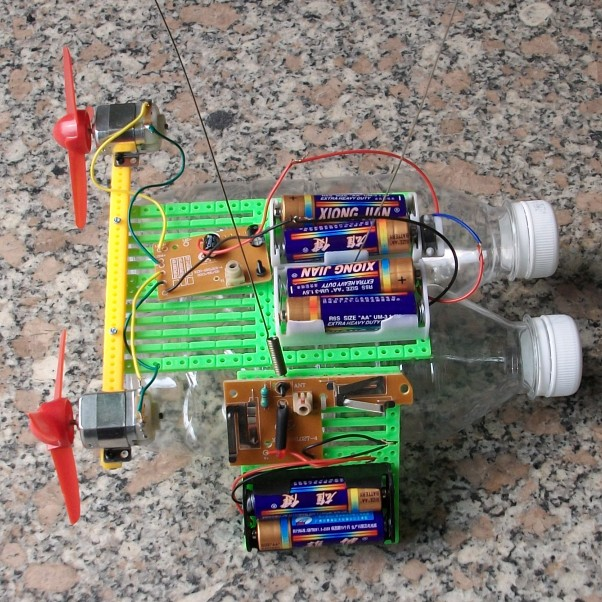
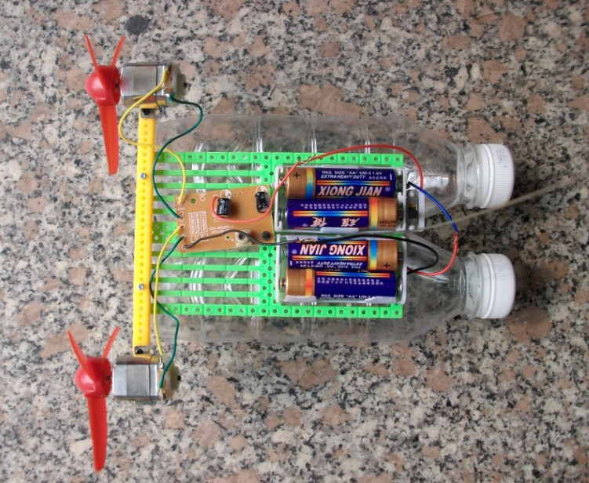
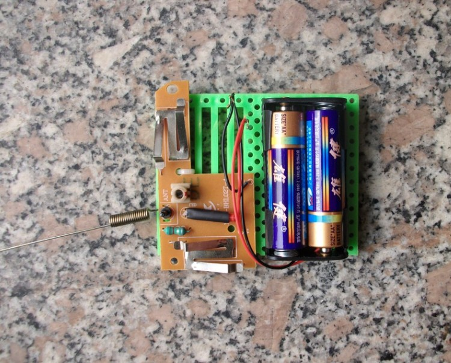
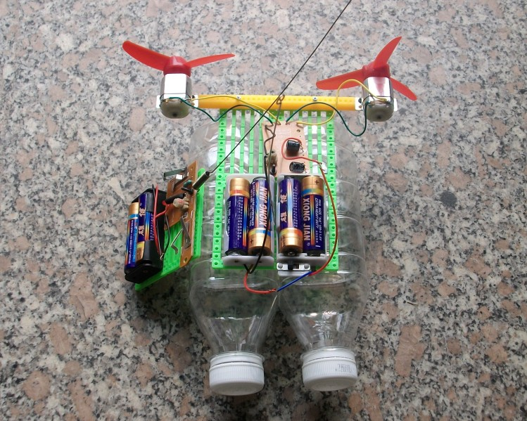
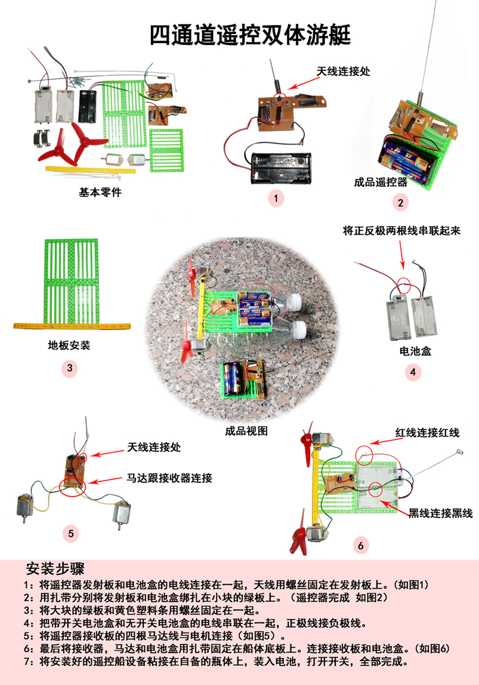

# 四通道空气动力遥控船
<https://item.taobao.com/item.htm?spm=a230r.1.14.116.EMQIat&id=39044033685&ns=1&abbucket=10#detail>

【参考尺寸】：宽度20厘米，长度25厘米，高度12.5厘米（瓶子种类不同，尺寸会不同）

【电池】：船体和遥控，共使用六节5号电池

【遥控距离】：8米以下

