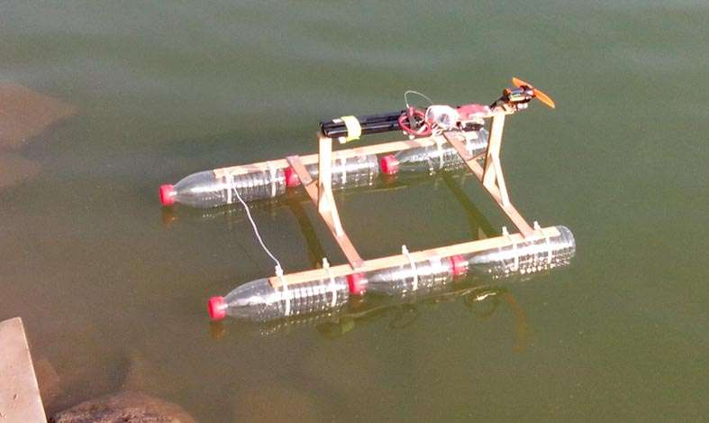
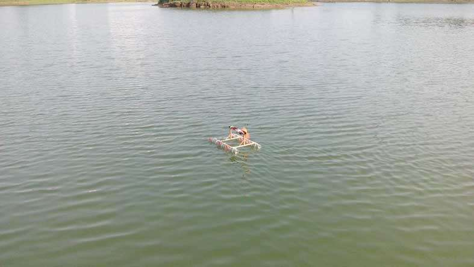

# 风动救援船

用被烧坏后重绕线圈的2218无刷电机做动力

加废矿泉水瓶和木条等做的一条风动救援船，已经成功实施了两次救援。

长：650MM、宽：400MM、高：250MM

重绕线圈的2218无刷，比原来少绕了一圈，改用星形接法，KV值大概在2300左右。

配7寸桨，用2S4200MAH15C锂电。

一个以前淘的特价有点问题的50A红皮单向电调。

舵机：3003。控和接收：FS T4B+ GR3E。

速度比较慢，看来矿泉水瓶的阻力不小。不过做救援船足够了。