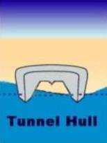

船体类型及其用途

# 平船身（Plaing Hulls）

平船身是为在水面表面行驶而设计的。船底越平，在水面表面行驶越容易。

同时，由于船身较平，较小的动力就可以达到高速。

缺点就是船难以控制。

另外，平底船身在有风浪的水中，表现较差。

很多平底船身利用浅V型船底来提高在风浪中的表现。

图中的 Fountain 42RC 的设计中，包括了很多现代船只设计中包括的基本元素：

* 用V型船底来增加在风浪中的性能，
* 用阶梯型的船底，来提高水的托升力。

# 排水型船身 

排水型船身具有圆的船底，从船头到船尾呈水滴型。

排水型船底具有很高的效率——很多远洋轮船都采取这种设计。

但是，由于这种船身的形状，使船速受到了限制。

图中的 Cape Horn 65中，就包括了排水型船身的几种代表性元素。

下面几种是平底船身和排水型船身衍生出的船身类型

# 平底型 （Flat Bottom） 

平底船多数出现在小的快艇中。

平的船底，可以很容易的在水面表面达到高速。

这种平底船身，多数是在平静的水中使用。

因为在风浪中性能下降，特别是在高速的时候。

同时，平的船底不太稳定，使用的时候应当特别注意安全。

# 圆船底型 ( Round Bottom) 

（我觉得这种船身就是大家所说的O艇吧！） 这种船就是在水中滑行。

因为这种船型在风浪的水中具有很高的效率。

很多游艇和动力船只都采用这种船身。 

总的来说，大多数圆船底的船只航速较低。 

另外，这种船身需要有龙骨、或者其他的稳定装置，因为这种船身很容易随着波浪摇摆。

在有风浪的时候，船身晃动很厉害。

# V型 (Deep V)  

V型船身是设计在有风浪的水面使用的，V型的船身可以分切水面和风浪，提供稳定的行进。 

但是，V型船身效率不如圆船底型和平底型船只，需要较高的动力来达到高速。 

现在使用的大多数船只的设计汇总，都有V型船底元素。

# 多体船 (Cathedral Hull)

多体船由两个或者更多的船身连接构成。 

这种联合船身，具有更高的稳定型。

另外，在船身之间形成的空气包，可以提供额外的浮力，使船身上提，提高效率。

# 隧道型船身 (Tunnel Hull)

Catamaran就是典型的隧道船身。 

这种船身是由两个船身由一个平台连接。

这种船身正在被越来越多的人所接受，因为这种船身集中了其他船身设计的优点，比如稳定性，速度，操作性能等。

并可以在很多水情况中使用，总体表现比单体船优秀。

什么样子的船体形状跑得更快

V型

民用船的话 这种船底好开

阶梯型的船底 提高水的托升力

"断阶减阻 在船底设置单级或多级断阶.能有效提升滑行效率,其阻力比无断阶时,可减少20%左右."

"高速时,水流在段阶处分离,使后体处于半通气状态,从而减少了湿表面积,降低了阻力.同时又不致显著地影响水动升力"

<http://bbs.mx3g.com/forum.php?mod=viewthread&tid=35090>