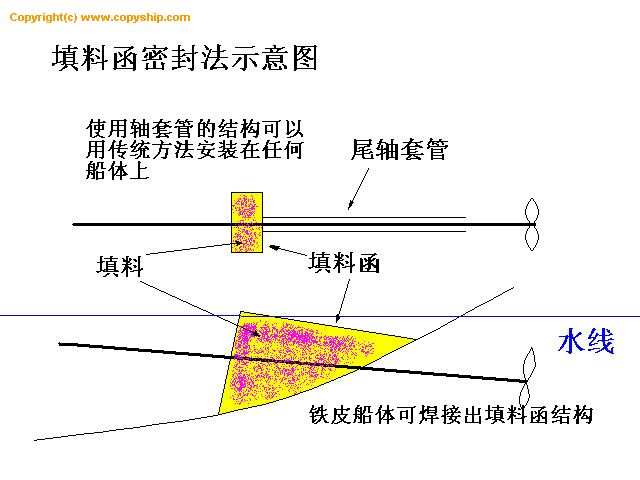
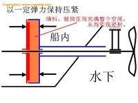
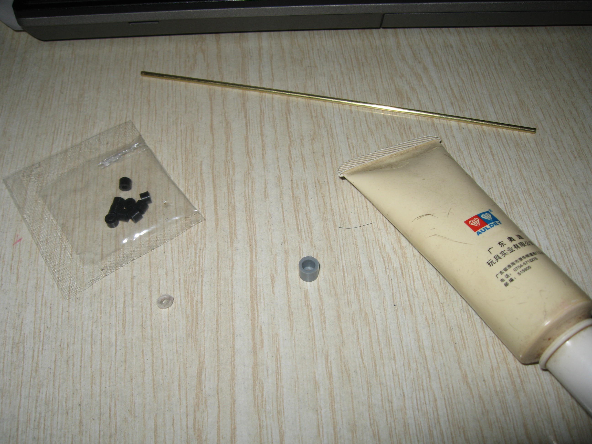
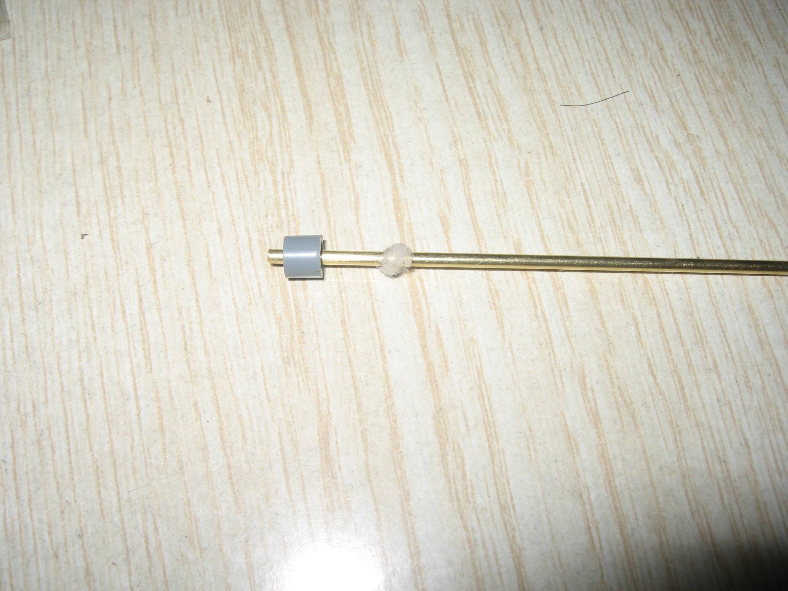
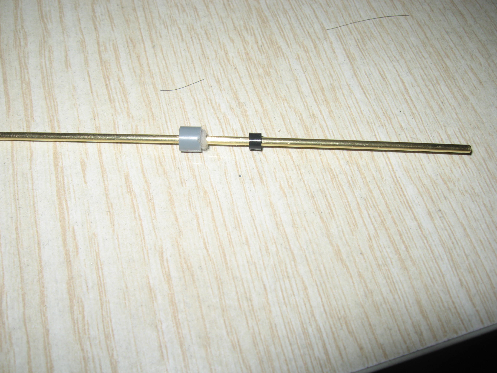
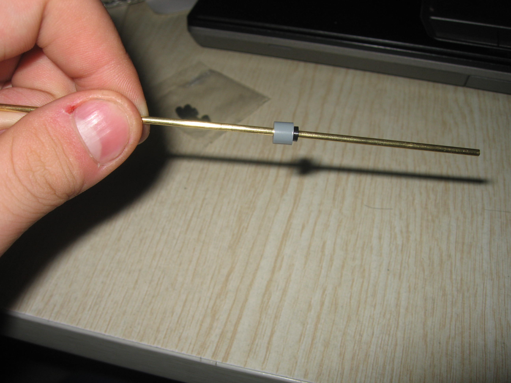
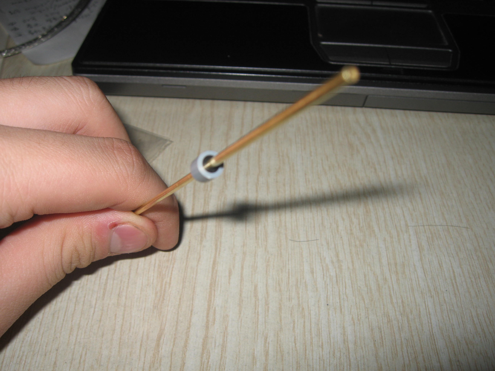
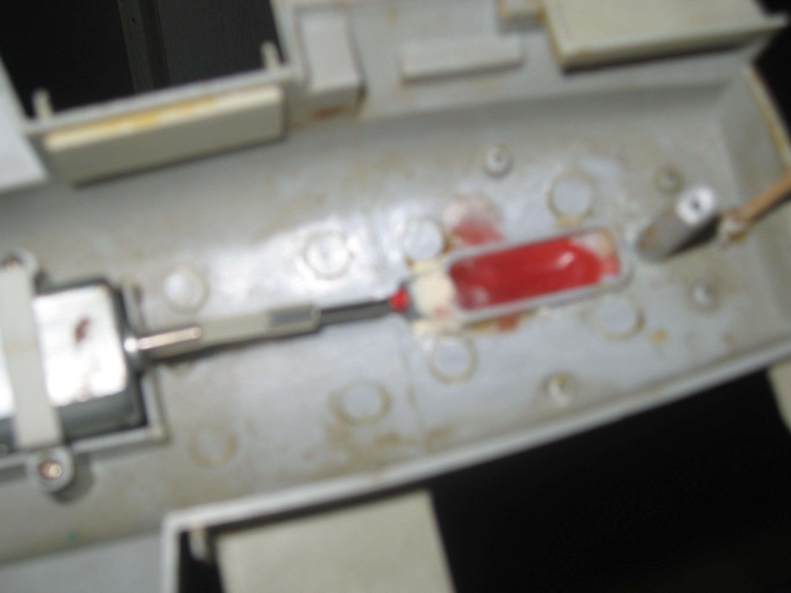

# 船模防水

出处：<http://tieba.baidu.com/p/543436444?pn=1>

将精密的静态模型改装为遥控模型或制作电动模型时经常会涉及到轴与轴套管之间的密封问题。 

传统的解决方法是在周套管里灌入大量密封油或用蜡制作类轴套管后再灌入大量密封油。 

这种方法一旦船轴在高速转动时很快会把防水用的密封油代出来，导致船体进水。电动模型还好一点，因为转速低。而遥控模型如果采用标准遥控电池供电的话（7.2v）转速则要高得多，此种现象就更明显。

故此，传统的防水方法只能起一时的功效。对于一般的电动船也就凑合了。

而对于遥控模型，如果航行在湖中间开始漏水的话，那就会损失惨重。数百乃至数千元的遥控设备就泡汤了。 

这种方法客服了以往用黄油密封而损失大量黄油的事故。其采用固态填充物代替黄油。无论转速多高也不可能流失密封油。 

其结构如下图

固体填料可用棉花配以较稀的润滑油构成。填料将填料函充满。

由于是具有弹性的棉花。所以可使船轴转动畅通。

而防水原理则如下图

水压使填料压紧，增加密封性。 

具体制作方法如下（本人用的所有材料均是常见的。模友如果没有也可找其他相似物代替） 

材料： 

以1/350的船为例 

1. 用作船轴的2mm直径铁或铜轴 
2. 田宫1/700大和级战列舰模型中的B35号版件（此版件在原模型中只起固定主炮作用。没有的话用热熔主炮甲板下的部分就能固定了） 
3. 田宫1/700大和级战列舰模型中的小胶管（也是固定主炮用的） 
4. 棉花（我用的是从棉签上撕下来的） 
5. 润滑油（我用的是悠悠球的） 

如下图

中间那个灰色的就是B35号件，中间有个孔的碗型件。

袋子里的是小胶管，袋子下面的是一小点棉花。 

制作方法 

1. 将棉签撕下一些棉花（能塞进B35号件就行），一定要使棉花很蓬松千万不要压紧。 
2. 将棉花涂上润滑油，一定要让棉花完全吸油。 
3. 将吸过油的棉花裹在船轴上塞进B35号件使棉花完全进去，船轴从小孔穿出。

如下图

然后在有棉花的一侧套上一个小胶管如下图

在胶管的外册涂一些润滑油，一定是外侧。

胶管要随着船轴一起运动。

然后将胶管也压进B35件里 

压好的正面图

然后将此防水部分胶管朝向电机方向粘在船内出轴位置前，先用胶粘然后用补土加固（注意不要用郡士管状白补土，因为它是水溶性的） 

在小胶管前安置一小弹簧（圆珠笔的就行）为了给密封填料增加压力。

小弹簧稍稍压紧。（压得太紧则会使船轴摩擦过大，不宜转动） 

然后在装上传统的铜管等最好在此密封管前在加一道蜡封。

铜管与蜡封之间可以不加黄油了。

如图

最前面是此密封函，然后是蜡，船底有一小段铜管。 

这是ZDF的1/800航母，我用来实验水密性的。

此船在两节飞利浦2100MA镍氢电池的驱动下，以倒车运动了10分钟，一滴水也没有进来。

倒车对防水考验比正着要严峻得多。

只要做出密封函的结构就行了，不用非要为此单买一田宫模型。

之所以选用田宫中的那个是因为这好手边有一1/700的武藏，且田宫胶管与B35件结合很紧不到1丝，有利与防水。

