风车效果图：

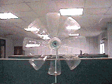

风车製作步骤:

源由: 当瓶子拿去做杯罐或水火箭之后,往往会剩下瓶首部份,為了完全利用瓶子,等分切开之叶片,再以斜角摺开(如同花朵状之螺旋桨),配上瓶盖為轴承,就是耐用好玩的风车。

利用西卡纸平行捲住瓶子,在欲裁切的位置画上线。    
使用美工刀或剪刀,延著线条剪开,修剪处儘量平整 。 

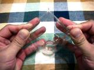

利用双手在瓶口的两侧对称捏住。      
重复对称捏出八个等份       
使用可口可乐或奥利多,瓶子本身就有线条,即可直接剪开。(可折出10支叶片) 

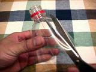

使用剪刀沿著折线向瓶头中心直线剪开。      
必须儘量剪直,同时保持八等份均匀(旋转时较稳定)。    

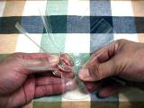

顺序将每一叶片,向外折弯,与瓶身成90度角。       
在折叶片的同时,在叶根之单侧施力外折,使叶片约呈30度的斜角。 

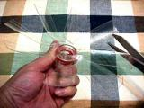

在每一片叶片的末端转角处,使用剪刀修剪掉尖角,是防止在旋转时被刮到。     

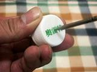

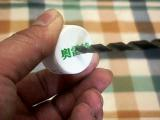

使用尖钻对準瓶盖上的中心射出点，钻出定位点。       
使用钻头，钻出圆的孔（依使用的轴心外径，决定钻头的尺寸）（以５ｍｍ钻头為例）。        
中心点愈準，风车叶旋转时，比较不会偏斜、震动。

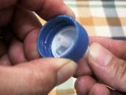

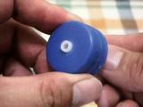

取一支约１５ｍｍ长，５ｍｍ外径，内径约３ｍｍ的管子。         
将管子插入瓶盖的中心孔内，管子露在外面约２ｍｍ即可。      

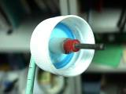

插入中空管后，管子露在外面约２ｍｍ即可。      
使用热熔胶，将中空管子固定，同时调整管子与瓶盖在同一轴心上。      
热熔胶不可滴在盖子的螺牙或内侧的凹处，否则会盖不平。

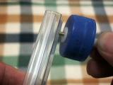

将铁钉或尖牙螺丝穿入中空管内，同时在管子的两侧加上垫片（较顺畅）。        
再将铁钉或螺丝，连带瓶盖钉或锁在木条上（使用木条、铁丝、ＩＣ管皆可）。        
不可以钉的太紧，否则易卡住。

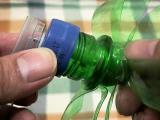

将风车叶与瓶盖锁紧。      
用手转动风车叶，观察叶片是否偏斜，再予以调整修正。      
到此即完成，可以挥著或对电风扇试试看效果如何了。 

+ 瓶子採用汽水瓶较佳，因為没有太多线条，所以比较容易做（推蔫可口可乐的曲线瓶及奥利多瓶较佳）。     
+ 叶片长度及等分比例，儘量均匀，旋转起来比较稳定。
+ 瓶盖转轴的中心轴线要準确，才不会偏斜旋转。
+ 风车柄可以採用木条或装ＩＣ的塑胶管来安装（废物利用哦），也可以拿一支晒衣架，将它拆开折直，前端外皮去除５公分，将没有皮的铁线穿入转轴管内，管子的两侧加垫片及加上橡皮档子，将瓶盖转轴作定位即可。 

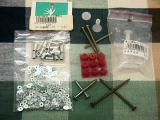

中空管有许多材料可以运用﹕

+ 如五金用的金属拉钉﹕有管子也有钉子。
+ 装订用的塑胶铆钉。 
+ 电机材料的铆接铜管。 

只要内孔径在２ｍｍ到３‧５ｍｍ左右均可。 

穿过管子的轴心，可用铁钉、尖牙螺丝钉、Ｍ３螺丝、晒衣架的铁丝均可。

转轴如有毛边或不平整之处，须利用挫刀修整一下。 

