# 三阶魔方

## 第一步：对好第一面十字

### 目标

最终对好的十字必须如图，每个侧面的棱和中心是同色的。

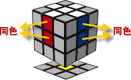

### 简化小花

为了对成这样，我们要先对好下图这样的一朵小花，这朵小花是在白色的对面，也就是黄色为中心的面，他的好处是不用对齐侧面颜色,这会给我们减少很大的难度。后面我们可以很方便的把这朵小花变成第一面十字这样。

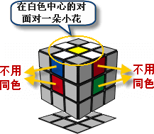

把这朵小花变成四面都对齐颜色的白色十字。其实非常简单，就是把四个小棱块逐一对好侧面颜色，然后翻下去就行了。

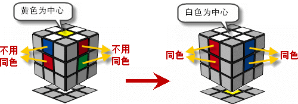

## 第二步，对好第一面加上四个侧面的T字形

这一步的目标是对成下面这个样子:

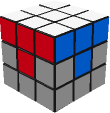

## 第三步，处理第二层的四个棱色块，对好前两层

这步我们最后对好前两层后，就会是下图这个样子:

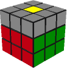

### 口诀：“远切回回，接孩子放学”

这步我们要处理的是中间层红绿，绿橙，蓝橙，蓝红四个棱色块。

这次，你要先把魔方翻过来了，白面朝下，黄色为中心的面朝上，你要在顶层找到这四个棱块，有一个窍门，顶层只要不含有黄色的棱色块一定是这四个之一，这里以红绿为例，通常，你会碰到两种情况:

<table><tr><td>
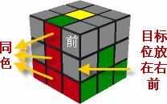
</td><td>
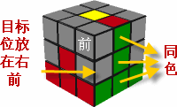
</td></tr></table>

####  第一种情况

<table>
<tr align="center">
<td width="20%">&nbsp;</td>
<td width="20%"> U远</td>
<td width="20%">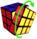 R切</td>
<td width="20%"> U'回</td>
<td width="20%"> R'回</td>
</tr>

<tr>
<td>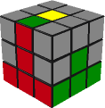</td>
<td>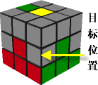</td>
<td>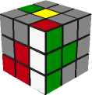</td>
<td>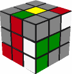</td>
<td>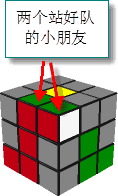</td>
</tr>

<tr>
<td  bgcolor="LightGreen">初始状态</td>
<td  bgcolor="LightGreen">
"远"： 
红绿棱色块远离目标位置
</td>
<td  bgcolor="LightGreen">
"切"： 
底面三个白色切开初始状态三个同色对成一排的那个面。

在这第一种情况，刚才不是三个红色在前面对成了一排吗?那就切开前面。	
</td>
<td  bgcolor="LightGreen">
"回"： 
第一步<strong>"远离"</strong>那个动作回来。	
</td>
<td  bgcolor="LightGreen">
"回"： 
第二步<strong>"切开"</strong>那个动作也回来。
你看现在顶层有两个组合好的小色块，就像小朋友站好队了，下面我们要接他们回家。

</td>
</tr>
<tr>
<td>U'下面四步，接孩子放学 </td>
<td>F' </td>
<td>U  </td>
<td>F  </td>
<td>&nbsp;</td>
</tr>
<tr>
<td>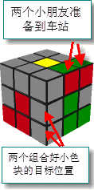</td>
<td>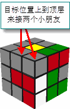</td>
<td>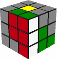</td>
<td>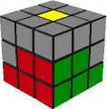</td>
<td>&nbsp;</td>
</tr>
<tr>
<td  bgcolor="LightGreen">
下面四步，<strong>"接孩子放学"</strong>：顶层两个组合好的小色块（两个小朋友），先准备到车站。 对照上一步的图，你可以看出，这个车站是在目标位置的另一侧。
</td>
<td bgcolor="LightGreen">
目标位置就像巴士一样开到顶层来接两个小朋友。 你要注意，巴士开到顶层的时候，小朋友不能受到影响，还要保持在顶层，你就不会去错拧另一个侧面了...
</td>
<td bgcolor="LightGreen">两个小朋友上车。	</td>
<td bgcolor="LightGreen">巴士开回去。	</td>
<td bgcolor="LightGreen">&nbsp;</td>
</tr>
</table>

####  第二种情况

其实口诀都是一样的，也是"远切回回，接孩子放学。"，但是这回是往另外一个方向远离，切开另外一个面，所有步骤都好像照个镜子一样。

<table>
<tr align="center">
<td width="20%">&nbsp;</td>
<td width="20%"> U'远</td>
<td width="20%"> F'切</td>
<td width="20%">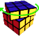 U回</td>
<td width="20%">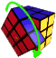 F回</td>
</tr>

<tr>
<td>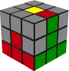</td>
<td>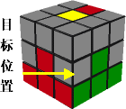</td>
<td>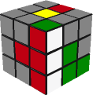</td>
<td>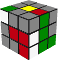</td>
<td>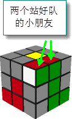</td>
</tr>

<tr>
<td bgcolor="LightGreen">初始状态</td>
<td bgcolor="LightGreen">"远"： 红绿棱色块远离目标位置 ，与第一种情况不同，他是往另一侧远离，因为这回他在目标位置的另一边。	</td>
<td bgcolor="LightGreen">"切"： 底面三个白色切开初始状态三个同色 对成一排的那个面。 第二种情况，刚才是三个绿色在右面对成了一排，那就切开右面。	</td>
<td bgcolor="LightGreen">"回"： 第一步<strong>"远离"</strong>那个动作回来。	</td>
<td bgcolor="LightGreen">"回"： 第二步<strong>"切开"</strong>那个动作也回来。你看，这回两个小朋友也在顶层站好队了，下面我们也要接他们回家。
</td>
</tr>

<tr>
<td>U 下面四步，接孩子放学 </td>
<td>R  </td>
<td>U' </td>
<td>R' 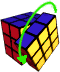</td>
<td></td>
</tr>

<tr>
<td>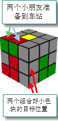</td>
<td>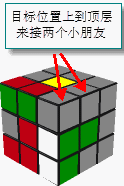</td>
<td></td>
<td></td>
<td></td>
</tr>

<tr>
<td bgcolor="LightGreen">下面四步，<strong>"接孩子放学"<strong>：顶层两个组合好的小色块（两个小朋友），先准备到车站。 对照上一步的图，你可以看出，这个车站是在目标位置的另一侧。	</td>
<td bgcolor="LightGreen">目标位置就像巴士一样开到顶层来接两个小朋友。 你要注意，巴士开到顶层的时候，小朋友不能受到影响，还要保持在顶层，你就不会去错拧另一个侧面了...	</td>
<td bgcolor="LightGreen">两个小朋友上车。	</td>
<td bgcolor="LightGreen">巴士开回去。	</td>
<td bgcolor="LightGreen"></td>
</tr>

</table>

## 第四步，在新的黄色顶面画十字

这步我们要变成下面的样子:

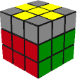

下面我们要学一个新的公式，这个公式会把顶层在如下4种情况中切换，顶面的4个棱色块在旋转之后，也只可能有这4种情况:

<table>
<tr align="center">
<td width="25%" >1 点 </td>
<td width="25%" >2 小拐弯</td>
<td width="25%" >3 一字</td>
<td width="25%" >4 十字 </td>
</tr>

<tr>
<td>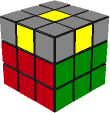</td>
<td></td>
<td>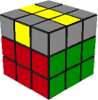</td>
<td></td>
</tr>

<tr>
<td>概率1/8</td>
<td>概率1/2,小拐弯要放在右前角</td>
<td>概率1/4，一字要平行于你</td>
<td>概率1/8</td>
</tr>
</table>

这步我们把角色块都当成灰色的，只看棱色块，比如你要见到左下图这样，就算是上面第2种情况"小拐弯",见到右下图这样，就算上面第3种情况"一字"。

<table>
<tr>
<td>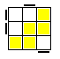</td>
<td></td>
</tr>
</table>

