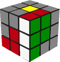
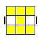

# 三阶魔方

<http://www.rubik.com.cn/beginner2.htm>

## 第一步：对好第一面十字

### 目标

最终对好的十字必须如图，每个侧面的棱和中心是同色的。

### 简化小花

为了对成这样，我们要先对好下图这样的一朵小花，这朵小花是在白色的对面，也就是黄色为中心的面，他的好处是不用对齐侧面颜色,这会给我们减少很大的难度。后面我们可以很方便的把这朵小花变成第一面十字这样。

把这朵小花变成四面都对齐颜色的白色十字。其实非常简单，就是把四个小棱块逐一对好侧面颜色，然后翻下去就行了。

## 第二步，对好第一面加上四个侧面的T字形

这一步的目标是对成下面这个样子:

## 第三步，处理第二层的四个棱色块，对好前两层

这步我们最后对好前两层后，就会是下图这个样子:

### 口诀：“远切回回，接孩子放学”

这步我们要处理的是中间层红绿，绿橙，蓝橙，蓝红四个棱色块。

这次，你要先把魔方翻过来了，白面朝下，黄色为中心的面朝上，你要在顶层找到这四个棱块，有一个窍门，顶层只要不含有黄色的棱色块一定是这四个之一，这里以红绿为例，通常，你会碰到两种情况:

<table><tr><td>

</td><td>

</td></tr></table>

####  第一种情况

<table>
<tr align="center">
<td width="20%">&nbsp;</td>
<td width="20%"> U远</td>
<td width="20%"> R切</td>
<td width="20%"> U'回</td>
<td width="20%"> R'回</td>
</tr>

<tr>
<td></td>
<td></td>
<td></td>
<td></td>
<td></td>
</tr>

<tr>
<td  bgcolor="LightGreen">初始状态</td>
<td  bgcolor="LightGreen">
"远"： 
红绿棱色块远离目标位置
</td>
<td  bgcolor="LightGreen">
"切"： 
底面三个白色切开初始状态三个同色对成一排的那个面。

在这第一种情况，刚才不是三个红色在前面对成了一排吗?那就切开前面。	
</td>
<td  bgcolor="LightGreen">
"回"： 
第一步<strong>"远离"</strong>那个动作回来。	
</td>
<td  bgcolor="LightGreen">
"回"： 
第二步<strong>"切开"</strong>那个动作也回来。
你看现在顶层有两个组合好的小色块，就像小朋友站好队了，下面我们要接他们回家。

</td>
</tr>
<tr>
<td>U'下面四步，接孩子放学 </td>
<td>F' </td>
<td>U  </td>
<td>F  </td>
<td>&nbsp;</td>
</tr>
<tr>
<td></td>
<td></td>
<td></td>
<td></td>
<td>&nbsp;</td>
</tr>
<tr>
<td  bgcolor="LightGreen">
下面四步，<strong>"接孩子放学"</strong>：顶层两个组合好的小色块（两个小朋友），先准备到车站。 对照上一步的图，你可以看出，这个车站是在目标位置的另一侧。
</td>
<td bgcolor="LightGreen">
目标位置就像巴士一样开到顶层来接两个小朋友。 你要注意，巴士开到顶层的时候，小朋友不能受到影响，还要保持在顶层，你就不会去错拧另一个侧面了...
</td>
<td bgcolor="LightGreen">两个小朋友上车。	</td>
<td bgcolor="LightGreen">巴士开回去。	</td>
<td bgcolor="LightGreen">&nbsp;</td>
</tr>
</table>

####  第二种情况

其实口诀都是一样的，也是"远切回回，接孩子放学。"，但是这回是往另外一个方向远离，切开另外一个面，所有步骤都好像照个镜子一样。

<table>
<tr align="center">
<td width="20%">&nbsp;</td>
<td width="20%"> U'远</td>
<td width="20%"> F'切</td>
<td width="20%"> U回</td>
<td width="20%"> F回</td>
</tr>

<tr>
<td></td>
<td></td>
<td></td>
<td></td>
<td></td>
</tr>

<tr>
<td bgcolor="LightGreen">初始状态</td>
<td bgcolor="LightGreen">"远"： 红绿棱色块远离目标位置 ，与第一种情况不同，他是往另一侧远离，因为这回他在目标位置的另一边。	</td>
<td bgcolor="LightGreen">"切"： 底面三个白色切开初始状态三个同色 对成一排的那个面。 第二种情况，刚才是三个绿色在右面对成了一排，那就切开右面。	</td>
<td bgcolor="LightGreen">"回"： 第一步<strong>"远离"</strong>那个动作回来。	</td>
<td bgcolor="LightGreen">"回"： 第二步<strong>"切开"</strong>那个动作也回来。你看，这回两个小朋友也在顶层站好队了，下面我们也要接他们回家。
</td>
</tr>

<tr>
<td>U 下面四步，接孩子放学 </td>
<td>R  </td>
<td>U' </td>
<td>R' </td>
<td></td>
</tr>

<tr>
<td></td>
<td></td>
<td></td>
<td></td>
<td></td>
</tr>

<tr>
<td bgcolor="LightGreen">下面四步，<strong>"接孩子放学"<strong>：顶层两个组合好的小色块（两个小朋友），先准备到车站。 对照上一步的图，你可以看出，这个车站是在目标位置的另一侧。	</td>
<td bgcolor="LightGreen">目标位置就像巴士一样开到顶层来接两个小朋友。 你要注意，巴士开到顶层的时候，小朋友不能受到影响，还要保持在顶层，你就不会去错拧另一个侧面了...	</td>
<td bgcolor="LightGreen">两个小朋友上车。	</td>
<td bgcolor="LightGreen">巴士开回去。	</td>
<td bgcolor="LightGreen"></td>
</tr>

</table>

## 第四步，在新的黄色顶面画十字

这步我们要变成下面的样子:

下面我们要学一个新的公式，这个公式会把顶层在如下4种情况中切换，顶面的4个棱色块在旋转之后，也只可能有这4种情况:

<table>
<tr align="center">
<td width="25%" >1 点 </td>
<td width="25%" >2 小拐弯</td>
<td width="25%" >3 一字</td>
<td width="25%" >4 十字 </td>
</tr>

<tr>
<td></td>
<td></td>
<td></td>
<td></td>
</tr>

<tr>
<td>概率1/8</td>
<td>概率1/2,小拐弯要放在右前角</td>
<td>概率1/4，一字要平行于你</td>
<td>概率1/8</td>
</tr>
</table>

这步我们把角色块都当成灰色的，只看棱色块，比如你要见到左下图这样，就算是上面第2种情况"小拐弯",见到右下图这样，就算上面第3种情况"一字"。

<table>
<tr>
<td></td>
<td></td>
</tr>
</table>

在用公式之前，你应该参照上图顶面黄色的样子来确定你魔方 顶层怎么摆。

我们只要对出十字就好啦，并不需要十字侧面的颜色和下两层吻合。

这个公式会按顺序从左到右在这4种情况中切换，也就是如果你遇见"点"(就是上面第一个图)，你就要应用3次这个公式(**每次之前都要按照上图摆好魔方顶层的方向再开始哦**)，遇见"小拐弯"就要应用2次公式。 公式如下: 

<table>
<tr align="center">
<td ></td>
<td width="14%"> F</td>
<td width="14%"> R</td>
<td width="14%"> U</td>
<td width="14%"> R'</td>
<td width="14%"> U'</td>
<td width="14%"> F'</td>
</tr>
<tr>
<td></td>
<td></td>
<td></td>
<td></td>
<td></td>
<td></td>
<td></td>
</tr>
</table>

规则看白色区域的变化：

* 白色先切3个一行到后面。
* 白色再切2个到左边， 白色剩下2*2。  被切走的白色， 都在一边。
* 不影响切的2个情况下的选择顶层， 顺时针。
* 原路返回。

## 第五步， 调整顶层角色块的朝向，对好顶层黄色面

本部完成后的目标：

魔方顶面的四角只可能有8种情况，第一种就是已经对好，而其他7种如下。

<table>
<tr align="center">
<td width="12.5%"></td>
<td width="12.5%"></td>
<td width="12.5%"></td>
<td width="12.5%"></td>
<td width="12.5%"></td>
<td width="12.5%"></td>
<td width="12.5%"></td>
<td width="12.5%"></td>
</tr>
<tr align="center">
<td>0</td>
<td>1</td>
<td>2</td>
<td>3</td>
<td>4</td>
<td>5</td>
<td>6</td>
<td>7</td>
</tr>
<tr align="center">
<td></td>
<td>概率:4/27</td>
<td>4/27</td>
<td>4/27</td>
<td>4/27</td>
<td>4/27</td>
<td>4/27</td>
<td>2/27</td>
</tr></table>

### 小鱼1  逆时针小鱼

这个公式的作用就是保持鱼头的那个角的黄色始终朝上，同时把下面三个一顺的黄色翻到顶面。

<table>
<tr align="center">
<td width="25%"></td>
<td width="25%">R'</td>
<td width="25%">U'</td>
<td width="25%">R</td>
</tr>
<tr>
<td></td>
<td></td>
<td></td>
<td></td>
</tr>
<tr>
<td></td>
<td></td>
<td></td>
<td></td>
</tr>
<tr>
<td>U'</td>
<td>R'</td>
<td>U'2</td>
<td>R</td>
</tr>
<tr>
<td></td>
<td></td>
<td></td>
<td></td>
</tr>
<tr>
<td></td>
<td></td>
<td></td>
<td></td>
</tr>
</table>

### 小鱼2  顺时针小鱼

<table>
<tr align="center">
<td width="25%"></td>
<td width="25%">F</td>
<td width="25%">U</td>
<td width="25%">F'</td>
</tr>
<tr>
<td></td>
<td></td>
<td></td>
<td></td>
</tr>
<tr>
<td></td>
<td></td>
<td></td>
<td></td>
</tr>
<tr>
<td>U</td>
<td>F</td>
<td>U2</td>
<td>F'</td>
</tr>
<tr>
<td></td>
<td></td>
<td></td>
<td></td>
</tr>
<tr>
<td></td>
<td></td>
<td></td>
<td></td>
</tr>

</table>

小鱼的关键点：

* 三个角的黄色是顺时针方向， 就是顺时针方向就是顺时针旋转， 逆时针方向就是逆时针旋转。
* 第二步总是让顶层两个组合好的小色块向鱼头方向转，并且整个公式中两个组合好小色块一直保持着这个方向，在顶层要旅游一整圈，最后被接回底层。

### 其他情况

你有2/3的概率碰到他们，你可以用上面小鱼1和小鱼2的组合解决他们，你就记住一句话 *"2后4左"*。

我们只看它的左上角位置。
* 两个时，左上角 必有一个靠后。
* 四个时，左上角 必有一个靠左。

<table>
<tr align="center">
<td width="20%"></td>
<td width="20%"></td>
<td width="20%"></td>
<td width="20%"></td>
<td width="20%"></td>
</tr>
<tr align="center">
<td>3</td>
<td>4</td>
<td>5</td>
<td>6</td>
<td>7</td>
</tr>
</table>

## 第六步，调整顶层角色块顺序

目标： 形成如下的样子，四个角顺序调整好，侧面颜色都对齐，就剩下顶层的棱的顺序没对好了。

* 首先转转顶面看看是不是已经对好（概率1/6）
* 如果不是就首先找一条边，这条边的两个角有相同的颜色（概率2/3）

<table>
<tr align="center">
<td width="20%"></td>
<td width="20%">让黄色面朝着你自己</td>
<td width="20%">R2</td>
<td width="20%">D2</td>
<td width="20%">R'</td>
</tr>
<tr align="center">
<td></td>
<td></td>
<td></td>
<td></td>
<td></td>
</tr>
<tr align="center">
<td></td>
<td></td>
<td></td>
<td></td>
<td></td>
</tr>
<tr align="center">
<td>U'</td>
<td>R</td>
<td>D2</td>
<td>R'</td>
<td>U</td>
</tr>
<tr align="center">
<td></td>
<td></td>
<td></td>
<td></td>
<td></td>
</tr>
<tr align="center">
<td></td>
<td></td>
<td></td>
<td></td>
<td></td>
</tr>
<tr align="center">
<td>R'</td>
<td>让黄色面重新朝上</td>
<td>旋转顶层，
对齐四角颜色</td>
<td></td>
<td></td>
</tr>
<tr align="center">
<td></td>
<td></td>
<td></td>
<td></td>
<td></td>
</tr>
<tr align="center">
<td></td>
<td></td>
<td></td>
<td></td>
<td></td>
</tr>
</table>

* 你也有1/6的概率找不到这样一条有两角同色的边，你就直接做一遍上面的公式，哪条边放在右侧都可以，之后你就一定可以找到一条两角同色的边啦， 把这条边放在右侧，然后再用上面的公式就可以了.

## 第七步，调整顶层棱色块顺序，将魔方最后还原

第一种情况，你想让3个棱逆时针轮换。(概率1/3)

对于逆时针三棱换，首先你要把已经对好颜色的那个面放在前面（不一定是红色面哦）。再用第五步的小鱼1+ 整个魔方转180°+小鱼2 就行啦。魔方

